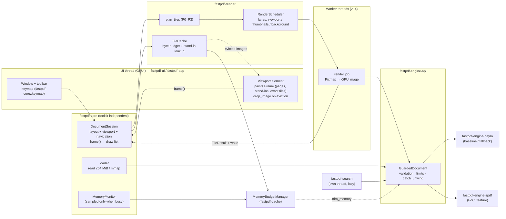

# FastPDF — Project Audit（M0）

- 日期：2026-10-04
- 範圍：spec §40（M0 Audit）、§49（Q1–Q7）、§50（Step 1–5）、§51（第一輪 10 項交付物）
- 依據：實際 clone、閱讀、build、執行三個 upstream 專案。不只讀 README（spec §49 Q4 的要求）。
- 量測環境：Windows 11 Pro 26200、AMD Ryzen 9 9950X（16C/32T）、128 GB RAM、NVIDIA RTX 5090 + AMD iGPU、1920×1080@60 Hz、rustc 1.99.0（`rust-toolchain.toml` pin 住）。**這是高階機器，KPI 在一般使用者的筆電上會更差。**
- Studio Memory：`context_build(project=fastPDF)` 回傳 `insufficient_evidence`，observation 也是 0 筆。目前沒有任何已核准的專案記憶，本文只依據 repo 與實測。

## 文件導覽（spec §51 交付物對照）

| # | 交付物 | 位置 |
|---|---|---|
| 1 | Repository audit | 本文〈Current pdf-reader-gpui Architecture〉到〈GPUI on Windows〉；細節在 [`architecture-current.md`](architecture-current.md)、[`audit/hayro.md`](audit/hayro.md)、[`audit/zpdf.md`](audit/zpdf.md)、[`audit/gpui.md`](audit/gpui.md) |
| 2 | Architecture diagram | 〈Target Architecture〉 |
| 3 | Dependency analysis | 〈Dependency Analysis〉 |
| 4 | License analysis | 〈Licensing〉 |
| 5 | Proposed workspace | 〈Proposed Workspace〉 |
| 6 | PdfEngine API | 〈PdfEngine API & Domain Model〉、[ADR 0002](adr/0002-pdf-engine-abstraction.md) |
| 7 | Benchmark plan | 〈Benchmark Plan〉 |
| 8 | Migration plan | 〈Migration Plan〉 |
| 9 | Risks | 〈Risks〉 |
| 10 | Recommended first PR | 〈Recommended First PR〉 |

## Executive Summary

**一句話**：三個 upstream 都不能直接當產品基底。FastPDF 已建立新的 workspace：

- Hayro（pin git rev）是 M1 baseline engine 與長期 fallback。
- zpdf 以 feature-gated PoC 進入 M3，是否成為主要 engine 等 M4 數據決定。
- UI 使用 pin 在 zed main 的 GPUI，texture 生命週期由 FastPDF 自己管理。

Q1–Q7 的答案（細節見〈Answers to Q1–Q7〉）：

| 問題 | 答案 | 信心度 |
|---|---|---|
| Q1 fork pdf-reader-gpui？ | **不 fork。新建 workspace，挑選性移植約 200–300 行**（texture 生命週期管理、過期結果丟棄、Windows 建置設定）。upstream clone 保留為 benchmark 對照組。 | 高（85%） |
| Q2 Hayro coupling 多深？ | **範圍窄、完全沒有隔離**：正式 render 只經過一個函式，但 `Arc<hayro_syntax::Pdf>` 與 `render_dimensions()` 直接出現在 UI 的 cache 與 layout。要換掉的是 render／cache／thread 設計本身。 | 高（90%） |
| Q3 GPUI 限制？ | **沒有 Windows blocker**。Texture 管理是最大風險（不會自動 evict，沒呼叫 `drop_image` 就永久洩漏），可控。idle 時 vsync thread 仍以 60 Hz 喚醒。0.2.2 太舊，要用 zed main。 | 中高 |
| Q4 zpdf 適合 interactive reader？ | **部分適合**：功能廣、對壞檔耐打，但開檔要整檔進記憶體（`Arc<[u8]>`，大檔會被複製）、沒有取消、Document 不是 Sync、cache 只有准入上限沒有淘汰、文字只到 span 等級、單一維護者、README 有不實宣稱。可以當候選，但要靠 adapter 補缺口。 | 中高 |
| Q5 zpdf GPU backend 適合 tile？ | **不適合**：每個 process 自建 device，每次 render 重傳全部影像，只能 readback。GPUI 在 Windows 是 D3D11、無法共享 texture。實測 9 份文件中 8 份 GPU tile 比 CPU 慢 1.4–23 倍。 | 高 |
| Q6 保留 Hayro fallback？ | **保留**。兩份 engine audit 獨立得到相同結論：Hayro 成熟、活躍、授權乾淨，可以零複製使用 mmap，`Pdf` 是 Sync。也是正確性比對的 reference。fallback 路徑同樣要套 guardrail。 | 高（80%） |
| Q7 最可能的瓶頸？ | 依序：① 文字逐 glyph 以 path 填色（沒有 glyph cache，繁中頁佔 render 約 90%）② 影像解碼（沒有快取，掃描或 JPX 頁 30–60 ms）③ 第一次字型解析（4–23 ms）④ tile 層級重複 interpret 整頁 ⑤ texture 記憶體與集中 upload 造成的卡頓。**PDF parse、GPUI layout、scroll 都不是瓶頸。** | 中高 |

本輪已完成的工程（全部有測試，`cargo test --workspace` 通過）：engine-neutral domain model 與 `GuardedDocument`、byte-budget cache 與 `MemoryBudgetManager`、tile grid／scale bucket／layout／viewport／scheduler／tile cache、incremental search、`DocumentSession`（toolkit 無關的 viewer 核心）、benchmark harness、fixture corpus（84 個檔案）。Hayro／zpdf adapter 與 GPUI app 正在進行中（見〈Migration Plan〉）。

## Current pdf-reader-gpui Architecture

完整內容見 [`architecture-current.md`](architecture-current.md)（M0 交付物：current architecture、dependency graph、render flow、thread flow、memory ownership、technical debt）。摘要：

- **規模**：commit `80e98d8`（v0.1.7），1,989 行，單一作者，沒有任何測試。邏輯幾乎全在 `lib.rs`（1,022 行）。
- **啟動與開檔**：整檔 `std::fs::read` 進記憶體。在 UI thread 上 `Pdf::new`，解析 xref 與完整 page tree，並兩次計算全部頁面尺寸，成本是 O(頁數)。不接受命令列參數。
- **Render flow**：`v_virtual_list` 決定可見頁 → 單一 `PDF Rasterizer` thread 依序整頁 rasterize（hayro 0.5、vello_cpu 單執行緒）→ RGBA 轉 BGRA，多配置一份整頁 buffer → `RenderImage` → GPU atlas。scale 固定為「視窗寬 ÷ 最寬頁面寬」，沒有 zoom，也沒有 HiDPI。
- **Thread flow**：UI thread 與一條 rasterizer thread 用 `Mutex` + `Condvar` 溝通。沒有取消機制，過期結果要等 render 完才丟棄。
- **Memory**：cache 保留「可見 ∪ 上一 frame 可見 ∪ 前一頁 ∪ 第 0 頁」的整頁 bitmap，沒有位元組上限。Letter 頁在 1536 px 寬時為 11.6 MB，CPU 與 GPU 各一份。好的地方是確實會呼叫 `drop_image` 釋放 GPU 記憶體。
- **嚴重問題**：每個 frame 都在 UI thread 重新 `Pdf::new` 一次，只為了判斷錯誤狀態（2000 頁 4.7 ms／frame，壞 xref 檔 47 ms／frame）；單頁 PDF 永遠是空白。
- **實測**：exe 25.1 MiB；Windows normal 依賴 501 個。啟動到視窗出現 286–519 ms（第一次 962 ms）。空視窗 private 100 MB、114 條 thread；開多頁檔後 private 181–185 MB。

## Renderer Architecture

| 面向 | pdf-reader-gpui | Hayro（HEAD `ced00dd0`） | zpdf（`fe0ed23`） |
|---|---|---|---|
| Render 單位 | 整頁 bitmap | 任意 affine + 任意大小 `RenderContext`（`render_into`）；每次呼叫都重新 interpret 整頁 | `PageRenderInfo.page_rect` 可以是任意子矩形；display list 可快取、可重播、可跨 thread 共用 |
| Tile 成本 | — | 1920×1080 區域在 1x–32x 幾乎固定（文字 1.3–3.4 ms、繁中 14–24 ms、JPX 約 30 ms）→ **合併相鄰可見 tile 一次 render** | 沒有 spatial index；adapter 端以 bbox culling 讓 CAD 頁全 tile 從 2087 ms 降到 237 ms（16 threads 21 ms） |
| Rasterizer | vello_cpu 0.0.5 | vello_cpu 0.3（u8 pipeline） | tiny-skia（CPU）；wgpu（GPU，不適合） |
| 輸出 | RGBA → BGRA（多一份 buffer） | premultiplied RGBA8 | premultiplied RGBA8 |
| 取消 | 無 | 無（#1052 open） | 無 API；adapter 只能在 command 之間檢查 |
| 文字 | 未接上的原型 | glyph 層級 Unicode + transform 可得（自訂 Device） | span 層級 |

FastPDF 的設計：tile grid（預設 508 px，加上 gutter 剛好對齊 512 px 的 atlas）+ 26 個 scale bucket + P0–P5 scheduler + progressive stand-in（[ADR 0003](adr/0003-tile-rendering.md)）。engine 差異由 adapter 吸收：Hayro adapter 合併可見 tile 的區域一次 render，zpdf adapter 快取 display list 並做 bbox culling。

## Threading

| | pdf-reader-gpui | Hayro | zpdf | FastPDF |
|---|---|---|---|---|
| Document 跨 thread | `Arc<Pdf>`，只有一條 render thread | `Pdf`／`Page` 是 `Send + Sync`；`RenderCache` 是 `!Send`，每個 worker 一份 | `PdfDocument` 是 `Send`，不是 `Sync`（`RefCell`）；`DisplayList`、`FontCache`、`ImageCache` 是 `Sync` | `EngineDocument: Send + Sync`；不是 Sync 的 engine 由 adapter 內部序列化並回報 `parallel_render: false` |
| 平行 render | 無 | 64 頁：1 thread 27.9 ms → 4 threads 11.3 ms → 8 threads 8.7 ms | 單一擁有者 interpret，raster 平行 | 固定 worker pool（預設 2–4），latency 優先；2/4/6/8 由 B-4 決定 |
| UI thread 負擔 | 每 frame 重新 parse | — | — | UI thread 只做 bookkeeping 與 paint；pixmap → GPU image 的轉換在 worker 上做 |

## Memory Model

- **pdf-reader-gpui**：整檔進記憶體，整頁 bitmap cache 沒有上限，每頁 CPU 與 GPU 各存一份。
- **Hayro**：可以零複製使用 mmap（800 MB 檔開檔 8.9 ms、working set 18 MB）。所有 cache 都沒有上限：content stream 留到 `Pdf` drop、font／glyph outline／object cache 也都會一直累積。沒有 decoded image cache，每次都重新解碼。
- **zpdf**：一定要 `Arc<[u8]>`，530 MB 檔 open 時 peak private 1015 MB。cache 只有准入上限，預設值很大（object 512 MiB、image 1 GiB、font 256 MiB）且不會淘汰。
- **GPUI**：`RenderImage` 不會自動從 atlas 移除；main 版會回收已釋放的 atlas 空間（0.2.2 不會，150 MiB tile 吃掉 630 MiB VRAM）。upload 在 UI thread 同步執行，64 MiB 約 8–11 ms。
- **FastPDF**（ADR 0004、0006）：小檔讀進記憶體、大檔 mmap 並禁止其他程式寫入；每個 cache 都有 byte budget，並註冊到 `MemoryBudgetManager`；GPU image 一律透過 eviction hook 呼叫 `drop_image`；engine 內部 cache 由 `trim_memory` 間接控制，做不到的記錄為風險。

## Hayro Integration

- **pdf-reader-gpui 目前的整合（Q2）**：`lib.rs` 約 15 個觸點加整個 `pdf.rs`。UI 層直接持有 `Arc<hayro_syntax::Pdf>`，也直接呼叫 `Page::render_dimensions()`，沒有任何抽象層。165 行的 `hayro_interpret::Device` 文字擷取原型沒有接上 UI，也沒有 ToUnicode，不移植。
- **FastPDF 的整合**：Hayro 只出現在 `fastpdf-engine-hayro`，由 `tools/check_engine_isolation.py` 強制。
  - pin git rev（≥ `ced00dd0`），因為 `render_into`（#1375）與多執行緒 race 修正（#1343）只在 HEAD；maintainer 表示 0.8 會有 breaking change。
  - adapter 責任：座標轉換、合併 tile 的區域 render、每個 worker 一份 `RenderCache`、Windows 系統 CJK 字型 resolver（非內嵌 Adobe-CNS1／GB1／Japan1／Korea1 預設會變成 Helvetica）、glyph 層級 text layer、頁面尺寸 guardrail（超過 65,532 px 會 panic）。
- 0.5 → HEAD 是大幅 breaking：Device trait 改寫、`interpret()` 只接受 `TypedIter`、`RenderCache`、vello_cpu 0.0.5 → 0.3。這也是不 fork、改為重寫 adapter 的原因之一。

## zpdf Architecture

19 個 crate，約 12 萬行，MIT。資料流：`zpdf-parser` → `zpdf-document`（catalog 與 page tree，開檔時走完整棵樹）→ `zpdf-content`（`ContentInterpreter` → `DisplayList`）→ `zpdf-render-cpu`（tiny-skia）／`zpdf-render-wgpu`。沒有高階 render API，呼叫端要自己串 8 個步驟。

- **優點**：覆蓋面廣（加密、JBIG2／JPX、ICC、透明度、annotation、CJK CMap 加系統字型 fallback、outline、links、page labels、XMP）。對 861 份惡意或損壞 PDF 0 panic、0 timeout。display list 可以跨 thread 共用。
- **問題**：
  - `/Rotate` 搭配非零原點 box 時內容會位移、被截掉，所有內建呼叫端都受影響；adapter 端 workaround 已驗證。
  - 整頁 raster 超過 64 MP 時會默默降低 scale。
  - shading 以 ≤ 2048 px 烘成影像。
  - CPU 與 GPU 結果的像素差異達 20.3%，README 宣稱 < 1%。
  - README 宣稱的 font LRU 與程式碼不符。
- **維護**：專案 4 個月，247 commits，主要作者佔 219 筆，34 筆帶 Claude co-author；3.5 個月發了 12 版；沒有 commit `Cargo.lock`。
- 決策：M3 以 pin rev（`fe0ed23`，包含 JBIG2 underflow 安全修正）的 git 依賴實作 PoC adapter，GPU backend 不用。見 [ADR 0005](adr/0005-zpdf-backend.md)。

## GPUI on Windows

詳見 [`audit/gpui.md`](audit/gpui.md) 與 [ADR 0001](adr/0001-use-gpui.md)。

- **Backend**：Direct3D 11 on DirectComposition。有 PerMonitorV2 manifest 與 `WM_DPICHANGED`；main 版修好了多數多螢幕、混合 DPI 的 bug，也支援觸控板像素捲動與 pinch（DirectManipulation）。
- **限制與對策**：
  - texture 不會自動 evict → FastPDF 的 tile cache eviction hook 一律呼叫 `drop_image`。
  - upload 在 UI thread → 每 frame 設 upload 預算，先顯示 stand-in。
  - 沒有 mipmap 與 atlas padding → tile 對齊 device pixel；需要時加 gutter。
  - idle 時 vsync thread 以 60 Hz 喚醒（0.5–1% of 1 core）→ 需要時對 GPUI 打 vsync park patch。
  - 持續按鍵時 present 會飢餓（#61469）→ 合併 notify，必要時 patch。
  - 沒有列印 → 自己走 Win32。
- **GPUI floor（最小 app，main 系）**：exe 9.8 MiB（LTO＋strip 6.3 MiB）；process 建立到第一個 frame 205–228 ms，其中 D3D11 device 建立約 115 ms；idle private working set 約 16 MiB、working set 約 68 MiB、commit 約 80 MiB（NVIDIA D3D11 device 本身就佔 WS 約 27 MiB、commit 約 53 MiB）。
- **gpui-component 不採用**：exe 多 6.2 MB、多 58 個 crate、clean build 時間翻倍，而且 0.6 起綁定第三方的 `gpui-pre`。

## Target Architecture（交付物 2）



開檔時序（spec §10、§11）：

```text
main()
 ├─ (background) load file (read / mmap) ──► open_guarded (minimal parse: xref + page count)
 └─ GPUI init (~200 ms on this machine) ──► window visible
                                              │
          both ready ──► DocumentSession::new (page 1 geometry only)
                         ──► frame(): plan P0 tiles of page 1 ──► workers render
                         ──► tiles arrive ──► wake ──► paint (first visible page)
                         ──► P1–P3 prefetch; other pages' sizes resolve lazily
```

## Dependency Analysis（交付物 3）

| 對象 | Normal 依賴（Windows） | 備註 |
|---|---|---|
| pdf-reader-gpui | 501 個 package | GPUI 0.2.2 的預設設定在 Windows 也會帶進 HTTPS client（rustls／ring／tokio）、`image` 全部 codec（含 rav1e）、Linux 才用的 blade／ash／naga；wasm 用的 git 依賴讓 native build 也要抓整個 zed repo |
| Hayro（render 最小組合） | 74 個 | 全部 permissive；最小 open+render exe 5.76 MB |
| zpdf（default／gpu） | 見 `audit/zpdf.md` | CLI exe 6.75 MiB；`zpdf-writer` 的 `timestamp` feature 會拉進 ureq／rustls／ring（網路），必須關閉 |
| GPUI main（minimal app） | — | exe 9.8 MiB；首次抓取 zed git 約 351 MB |
| gpui-component | +58 crates、+6.2 MB exe | 不採用 |
| **FastPDF（目前，不含 engine 與 GPUI）** | 14 個第三方 crate | memmap2、serde／serde_json（只用於 bench）、windows-sys 與它們的傳遞依賴；見 `THIRD_PARTY_LICENSES.md` |

Dependency policy（spec §36）的落實方式：
- workspace `Cargo.toml` 中每個第三方依賴旁都有一行理由註解。
- `fastpdf-engine-api`、`fastpdf-cache`、`fastpdf-render`、`fastpdf-search` 都只用 std。
- benchmark 的 CLI 參數解析、PNG 輸出都用 std 自己寫，不引入 clap 或 png crate。
- GPUI 一律 `default-features = false`。

## Licensing（交付物 4）

| 元件 | 授權 | 對 FastPDF 的意義 |
|---|---|---|
| pdf-reader-gpui | Apache-2.0，沒有 NOTICE 檔 | 移植程式碼時要附授權全文、保留來源聲明、標註「已修改」，並登記在 `THIRD_PARTY_LICENSES.md` 的 Ported source |
| Hayro | Apache-2.0 OR MIT；74 個依賴全為 permissive | 可放心使用 |
| zpdf | MIT；default 與 gpu 組態沒有非 permissive 依賴 | 不可開 `timestamp` feature（網路依賴） |
| GPUI（zed crates） | Apache-2.0 | **zlog／ztracing（經由 `sum_tree` 引入）在 2026-09-01（zed `ac5af8b9e1`，#63573）之前是 GPL-3.0-or-later**。pin 的 rev 必須在這之後；每次升級都要跑 `tools/license_report.py --check`。Zed 編輯器本身是 GPL-3.0，不可複製編輯器的程式碼 |
| gpui-component | Apache-2.0 | 不採用（依賴成本） |
| GPUI 0.2.2 的編譯期依賴 | `option-ext`（MPL-2.0），只經由 proc-macro 使用 | 不進 exe；改用 main 後需要重新檢查 |
| 測試語料 | 自行合成 | 嵌入系統字型的 fixture 只在本機產生，不 commit；upstream 的測試 PDF（PDFBox／pdf.js 等來源，授權混雜）只在本機引用 |
| FastPDF 本身 | **MIT OR Apache-2.0** | 2026-10-06 owner 決定不商業化、開源、個人發行（ADR 0012），取代 spec §37「保留商業化選項」 |

`tools/license_report.py` 會依 `cargo metadata` 產生 `THIRD_PARTY_LICENSES.md`，並以 `--check` 在 CI 擋下任何不在 permissive allowlist 內的授權。

## Risks（交付物 9）

| # | 風險 | 影響 | 機率 | 對策 |
|---|---|---|---|---|
| R1 | **Hostile PDF 造成無法攔截的失敗**：Hayro 的 10,000 層 `/Indexed` 鏈會 stack overflow，`catch_unwind` 無效；1 KB 檔可配置 1–2 GB；form XObject DAG 可讓 interpret 執行 30 秒以上 | 高（crash 或卡死） | 中 | 已做：Hayro adapter 的靜態掃描、有預算的預先解譯與 bomb 預解壓（`LimitExceeded` 取代 crash）。render host process + Job Object 記憶體上限（[ADR 0008](adr/0008-out-of-process-rendering.md) PR 1–4）已實作，**Windows 的預設**（`hayro-isolated`；`--engine hayro` 為 in-process）：crash、記憶體上限、hang 只會結束 host，頁面先重試、2 次 strike 後才永久失敗，crash storm 時停止重啟並顯示文件層級提示；hostile 語料經由 UI 跑完，UI 0 次結束。PR 4 的驗收（B-8 時間、吞吐量、idle CPU、記憶體）全部通過，見 ADR 0008 與 `docs/benchmarks/render-host.md`。upstream issue 草稿在 `docs/upstream-issues/` |
| R2 | GPU texture 洩漏或碎片化 | 高（VRAM、commit 持續成長） | 中 | 用 main 版 GPUI；tile cache eviction hook 一律 `drop_image`；CI churn 測試 |
| R3 | GPUI API 變動與 git pin 的維護成本 | 中 | 高 | GPUI 只出現在 `fastpdf-ui`；每 4–8 週評估升級一次；用 probe 與 bench 當升級門檻。`gpui_windows` 另有 3 個本地 patch（ADR 0011，`vendor/gpui_windows`）：升級時執行 `python tools/vendor_gpui_windows.py` 重新產生並確認 patch 還能套用，`--check` 確認 vendored crate 與 patch 一致、build 確實用到它；upstream 合併後移除 |
| R4 | 依賴授權回歸（例如再度引入 GPL crate） | 高（商業化受阻） | 低 | `license_report.py --check` 放進 CI；升級 GPUI 或 engine 時必跑 |
| R5 | zpdf 成熟度：bus factor 約 1、大量 AI 生成程式碼、API 每週變動、README 與實作不符 | 中 | 高 | pin 已 audit 的 rev；Hayro fallback；M4 用數據決定 |
| R6 | Hayro 1.0 前的 breaking change（0.8） | 中 | 高 | pin git rev；adapter 隔離；升級時跑 corpus |
| R7 | **非內嵌 CJK 字型**（台灣政府文件常見）顯示成 Helvetica 或空白 | 高（台灣使用場景） | 高 | adapter 實作 Windows 系統字型 resolver（MingLiU／JhengHei 等），並用 `fixtures/generated/cjk`、`traditional-chinese` 驗證 |
| R8 | KPI 定義不清：GPUI 本身到第一個 frame 就要 205–228 ms，「首頁 < 200 ms」從 process 啟動起算做不到；idle RAM 依指標而定：private WS 約 16 MiB，working set 約 68 MiB | 中 | 確定 | **已定義**（`benchmarks/README.md`〈App 層 KPI 定義〉）：Idle RAM 以 private working set 判定，commit 與 working set 一起報告，且不得修剪 working set。實測開著 3 頁文件為 24.9 MB，達成 < 50 MB；commit 107 MB 主要是 GPU driver。讀檔、開檔與 GPUI 初始化已平行進行。**小檔首頁已達成**（2026-10-05）：本地套用 GPUI 的啟動 patch（ADR 0011：平行建立 D3D device、不做字型 update check）後，3 頁 `first_page_exact` 中位數 171 ms（164–180 ms），配對的 HEAD 是 196 ms（`docs/benchmarks/b8-app.md`〈第九輪〉） |
| R9 | idle CPU 無法到 0：GPUI vsync thread 以 refresh rate 喚醒 | 低到中 | 確定 | **已在本地解決**（2026-10-05，ADR 0011）：idle 時 FastPDF 不 render，CPU 全部來自 GPUI 的 vsync 迴圈。vsync park patch 經由 vendored `gpui_windows` 套用後，idle 時主執行緒每秒喚醒 77 → 0 次、vsync thread 64 → 1 次（每秒一次的 device lost 檢查），CPU time 中位數 0.78% → 0% 單核（6 對配對，`docs/benchmarks/b8-app.md`〈第九輪〉）。剩下的週期性喚醒是 NVIDIA driver 自己的 thread（約 61 次／秒，不列入判定）。upstream 草稿仍在 `docs/upstream-issues/gpui-idle.md`，合併後移除本地 patch |
| R10 | 網路磁碟上的 mmap 在斷線時讓 process crash | 中 | 低 | 已做：UNC 路徑與 `DRIVE_REMOTE` 磁碟機上的檔案一律讀取、不 mmap（`loader::is_network_path`，ADR 0006）；render host 模式下由 host 讀取網路上的檔案，同樣不 mmap |
| R11 | Windows Defender 隔離惡意 PDF 測試檔（zpdf repo 已實際發生） | 低 | 中 | 惡意語料不 commit，放 `fixtures/local/`，由使用者決定是否加入排除清單 |
| R12 | 目前所有量測都在高階機器上（RTX 5090、60 Hz、100% 縮放） | 中（KPI 過度樂觀） | 確定 | **部分完成**（2026-10-06，`docs/benchmarks/low-end.md`）：以本機的 Radeon 內顯（2 CU）、WARP，加上 job object 的核心數限制與 duty cycle 降速（bench-app 1.3.0）模擬低階機器。KPI 確實過度樂觀：首頁時間和單核速度成正比，主流舊筆電等級約 0.57 秒、入門筆電等級約 1.15 秒，主要花在 GPU driver 建立 D3D11 device；idle RAM 在內顯上 44–50 MB；idle CPU 接近 0 與捲動反應在低階設定上仍成立。待做：Intel 內顯筆電實機、高更新率、混合 DPI；把 GPU driver 移出首頁關鍵路徑（先用 WARP 畫第一個 frame）列為候選 |
| R13 | 列印：GPUI 沒有列印 API | 中（V0.1 功能） | 確定 | Win32 GDI／XPS 列印路徑，以 engine 直接 render 到印表機解析度；V0.1 可以延後（spec §8） |
| R14 | 文字選取品質：zpdf 只到 span，Hayro 需要自建斷詞、分行 | 中 | 中 | 已做（2026-10-05）：選取與高亮仍是 content order 的字元範圍；複製（Ctrl+C、Ctrl+A 後複製）與搜尋共用同一套依字元幾何的組行（`fastpdf-engine-api` 的 `text/layout.rs`：`TextLayer::lay_out`，搜尋用不分段落的 `lay_out_lines`）。依字形前進方向分出閱讀方向（旋轉頁、旋轉文字、直排都適用）；同一基線上、content order 相鄰的片段併成一行（表格欄位），不相鄰的片段只在一個字高以內才併入，所以欄與欄不會合併；同一欄由上往下，並排的欄與區塊照 content order，頁首頁尾排在最前、最後；有可見間距補一個空白，兩側都是 CJK 時要一個字寬以上才算分隔（表格），不到一個字寬的 ASCII 空白拿掉；行距明顯大於區塊平常行距時以空行分段。搜尋（`fastpdf-search`）依這個閱讀順序比對，跨 span、跨行：查詢與內文用同一套正規化，空白、換行與字距空白在兩個非 CJK 字之間算一個空白，旁邊有 CJK 字（含全形標點）時不算字元（跨行的「公」／「文」可用「公文」找到，「檔　　號」可用「檔號」找到，中英之間有沒有空白都找得到），大小寫規則不變；跨行的結果每行一個高亮矩形。整理好的搜尋文字和文字層放在同一個有預算的 text cache（拉丁文約為文字層的 8%；沒有逐字框的 CJK 文字層本來就小，約多 40–100%，50 頁密集中文多 0.4 MB），重複搜尋只剩字串比對。冷搜尋（含擷取文字）比改動前多 0–9%，重複搜尋快 4–25 倍。後續：連字號合併、逐列交錯繪製的多欄、表格結構 |

## Recommended Fork Strategy（Q1）

**不 fork pdf-reader-gpui。** 理由：

1. spec §10–§18 要求的核心（lazy 開檔、tile、scheduler、取消、memory budget、engine 抽象）在 upstream 一個都不存在。render／cache／thread 設計要整段換掉，fork 等於保留檔名、重寫內容。
2. fork 會繼承兩個嚴重 bug（每 frame 重新 parse、單頁 PDF 空白）、零測試、wasm 雙 GPUI 版本的建置負擔，以及 GPUI 0.2.2。
3. 它用的是 Hayro 0.5，與 HEAD 之間 API 大幅變動，hayro 相關程式碼本來就要重寫。
4. Apache-2.0 允許直接複製需要的片段，不需要 fork 才能取用。

**移植清單**（實際移植時保留 copyright header，並登記在 `THIRD_PARTY_LICENSES.md`）：

| 來源 | 內容 | 去處 |
|---|---|---|
| `lib.rs:538-551, 641-644` | `ImageSource::Custom(Weak)` + `drop_image`，由 app 控制 GPU texture 壽命 | `fastpdf-ui` 的 tile texture 管理 |
| `lib.rs:464-471` | 過期 render 結果的丟棄判斷 | 已由 `GuardedDocument` 的取消檢查與 scheduler generation 取代 |
| `prompt.rs` | `NoDisplayHandle` workaround | 只有在改用 rfd 時才需要；FastPDF 使用 GPUI 內建的 `prompt_for_paths` |
| `build.rs` | winresource（exe icon、版本資訊）與 `+crt-static` | `fastpdf-app` 的 `build.rs`；`+crt-static` 已在 `.cargo/config.toml` |

upstream clone（`upstream/pdf-reader-gpui`）保留為 spec §28 的 benchmark 對照組。

## Answers to Q1–Q7

- **Q1**：見〈Recommended Fork Strategy〉。
- **Q2**：見〈Hayro Integration〉與 `architecture-current.md` 的 Hayro Coupling 章節（約 15 個觸點的清單）。
- **Q3**：
  - Windows rendering：有限制，中度，可繞過（vsync 喚醒、整窗 present、持續輸入時 present 飢餓、沒有列印）。
  - Scrolling：沒有阻擋性限制；2000 頁捲動穩定 60 fps，每 frame CPU 0.05–1 ms。
  - Texture：有限制，高度但可控（不會自動 evict、upload 在 UI thread、沒有 mipmap／padding、單張上限 16384²）。
  - High-DPI：沒有阻擋性限制（使用 main 版）。
- **Q4**：見〈zpdf Architecture〉。結論是「可以當候選，但不是現成的 reader engine」。正式取捨等 M4 的 `docs/engine-comparison.md`。
- **Q5**：不適合。V0.1 只用 CPU rasterization，GPU 只負責合成。若 engine 的 GPU backend 重新設計（共享 device、常駐資源、不需 readback），再依 B-7 重新評估（spec §19：不要假設 GPU 一定快）。
- **Q6**：保留。Hayro 是 M1 baseline engine、zpdf 的正確性 reference，也是逐頁 fallback 的候選（fallback 同樣經過 `GuardedDocument`）。
- **Q7**：依目前證據的排序：
  1. 文字 rasterization：沒有 glyph bitmap cache，繁中頁約 5 µs／glyph，佔 render 約 90%。
  2. 影像解碼：沒有快取、以全解析度解碼；掃描頁每頁 53–60 ms，JPX 頁約 30 ms。
  3. 第一次字型解析：4–23 ms。
  4. tile 層級重複 interpret：Hayro 每次呼叫都 interpret 整頁；zpdf 沒有 bbox culling 時全部 tile 是整頁成本的 7–10 倍。
  5. texture 記憶體與集中 upload。

  **不是瓶頸**：PDF parse（2000 頁 4–11 ms）、GPUI layout（每 frame 0.13 ms）、scroll（CPU 3–12% of 1 core）。改善方向：glyph cache、decoded image cache（有預算）、region 合併 render 或 display list 重播、upload 預算。每一項都要以 `fastpdf-bench` 驗證 Before／After。


## Proposed Workspace（Step 3／交付物 5）

已建立於本 repo（`Cargo.toml` workspace，edition 2024）。crate 拆分只服務 spec §5 的五個目的：compile isolation、backend replacement、benchmark、testability、dependency isolation。

| Crate | 責任 | 內部依賴 | 第三方依賴 | 狀態 |
|---|---|---|---|---|
| `fastpdf-engine-api` | Domain model（`DocumentId`、`PageIndex`、`PageSize`、`Rotation`、`RenderScale`、`PixelRect`、`PageRect`、`RenderRequest`、`Pixmap`、`TextLayer`、`OutlineItem`、`Link`、`DocumentMetadata`、`EngineError`、`ResourceLimits`、`CancelToken`）；`PdfEngine`／`EngineDocument` trait；`GuardedDocument`（驗證、guardrail、panic isolation） | — | **無**（只用 std） | 完成，23 tests |
| `fastpdf-engine-hayro` | Hayro adapter：座標轉換、block 合併的 tile render、guardrail（靜態掃描、預先解譯預算、bomb 預解壓）、Windows CJK 字型 resolver、glyph 層級 text layer、outline／links | engine-api | hayro（git `ced00dd0`，Apache-2.0 OR MIT）、memmap2、flate2 | 完成，46 tests；**V0.1 預設 engine**（ADR 0007） |
| `fastpdf-engine-zpdf` | zpdf adapter（M3 PoC，feature-gated），pin 在已 audit 的 commit | engine-api | zpdf 子 crate（MIT，git `fe0ed23`，不含 writer） | 完成，39 tests |
| `fastpdf-cache` | `ByteLru`（以 byte 計重的 O(1) LRU）、`SharedCache`（thread-safe、eviction hook、protected floor）、`MemoryBudgetManager`（Normal／Soft／Hard） | engine-api（只用 `MemoryPressure`） | 無 | 完成，11 tests |
| `fastpdf-render` | `ScaleBucket`／`ZoomLevel`、`TileGrid`／`TileKey`（含 gutter）、`DocumentLayout`（lazy 頁面尺寸）、`Viewport`、`plan_tiles`（P0–P3）、`RenderScheduler`（固定 worker、lane、cancel／discard）、`TileCache`（progressive fallback） | engine-api、cache | 無 | 完成，34 tests |
| `fastpdf-search` | 第一次搜尋才啟動、由目前頁往外搜尋、串流回報、可取消；`TextCache` 有預算 | engine-api、cache | 無 | 完成，11 tests |
| `fastpdf-core` | 文件載入（讀取／mmap）、`DocumentSession`（layout + viewport + scheduler + tile cache → 每 frame 的繪製清單；縮圖；close）、導覽與 zoom／rotate 指令、集中式 keymap、文字選取與複製、recent files、`MemoryMonitor` | engine-api、cache、render | memmap2、windows-sys | 完成，24 tests |
| `fastpdf-ui` | GPUI views：視窗、toolbar、viewport canvas（畫 `Frame`、texture 生命週期、upload 預算）、development overlay；sidebar／搜尋列／選取待做 | core、render | gpui（zed git `a846890`）、futures、image、log | 第一版完成 |
| `fastpdf-app` | Binary `fastpdf`：CLI、背景開檔與 GPUI 初始化平行、engine registry（cargo features）、`FASTPDF_LOG` logger、panic hook、`FASTPDF_BENCH` 時間點；檔案關聯與 icon 待做 | ui、core、adapters | gpui、gpui_platform、log | 第一版完成 |
| `fastpdf-print` | Win32 GDI 列印：印表機列表、頁碼範圍、份數、縮放與自動旋轉、印到檔案；以 256 列分段 render（buffer ≤ 8 MiB）；可取消；單頁失敗印空白並回報 | engine-api | windows-sys | 完成，25 tests（只用虛擬印表機測試） |
| `fastpdf-bench` | 無 GUI 的 benchmark harness：`open`／`render`／`full`／`corpus`／`compare`／`diff`／`diff-corpus`／`engines`，JSON 輸出，corpus 每個檔案一個子 process | engine-api、render、core、adapters | serde、serde_json、windows-sys | 完成，17 tests |

其他目錄：

- `fixtures/`：測試語料的說明與 manifest。產生器在 `tools/fixtures/`，產出放在 `fixtures/generated/`（不 commit）。真實世界的 PDF 放 `fixtures/local/`（不 commit）。
- `benchmarks/`：`baseline.json`（M1 基準），`runs/` 放每次量測的結果（不 commit）。
- `docs/`：本文件、`architecture-current.md`、`audit/*.md`、`adr/*.md`、`profiling.md`、`engine-comparison.md`（M4）。
- `tools/`：`fixtures/`（PDF 產生器）、`license_report.py`（產生 `THIRD_PARTY_LICENSES.md`）、`check_engine_isolation.py`（M2 驗收：只有 adapter 能依賴 engine）。

### 依賴圖（目標狀態）

```text
                         fastpdf-app (bin)
                        /      |        \
               fastpdf-ui      |     fastpdf-engine-{hayro,zpdf}   ← cargo features
                   |           |              |
                   +------ fastpdf-core       |
                          /    |     \        |
             fastpdf-search    |   fastpdf-render
                     \         |      /
                      +--- fastpdf-cache
                               |
                       fastpdf-engine-api   ← 零依賴的葉節點，所有人都只認得它

fastpdf-bench (bin) → engine-api, render, core, adapters (features)
```

規則：
1. `fastpdf-engine-api` 永遠零依賴。
2. 只有 `fastpdf-engine-<name>` 可以依賴該 engine（`tools/check_engine_isolation.py` 檢查 Cargo 依賴與原始碼）。
3. `fastpdf-ui` 是唯一依賴 GPUI 的 library crate。core／render／search 不知道 UI toolkit，因此可以在沒有視窗的情況下測試與 benchmark。

## PdfEngine API & Domain Model（Step 4／交付物 6）

完整設計與理由見 [ADR 0002](adr/0002-pdf-engine-abstraction.md)，程式碼在 `crates/fastpdf-engine-api`。重點：

```rust
pub trait PdfEngine: Send + Sync {
    fn info(&self) -> EngineInfo; // name, version, EngineCapabilities
    fn open(&self, source: DocumentSource, options: &OpenOptions)
        -> Result<Box<dyn EngineDocument>, EngineError>;
}

pub trait EngineDocument: Send + Sync {
    fn page_count(&self) -> u32;
    fn page_info(&self, page: PageIndex) -> Result<PageInfo, EngineError>;      // CropBox size + /Rotate
    fn metadata(&self) -> Result<DocumentMetadata, EngineError>;               // default: empty
    fn render(&self, request: &RenderRequest, target: &mut PixmapMut<'_>,
              cancel: &CancelToken) -> Result<RenderOutcome, EngineError>;
    fn text_layer(&self, page: PageIndex, cancel: &CancelToken)
        -> Result<TextLayer, EngineError>;                                     // default: Unsupported
    fn outline(&self) -> Result<Vec<OutlineItem>, EngineError>;                // default: Unsupported
    fn links(&self, page: PageIndex) -> Result<Vec<Link>, EngineError>;        // default: Unsupported
    fn trim_memory(&self, pressure: MemoryPressure);                           // default: no-op
}
```

和 spec §6 草稿的差異：

| Spec 草稿 | 採用的設計 | 理由 |
|---|---|---|
| `type Document; type Error;` | object-safe 的兩層 trait（`PdfEngine` → `Box<dyn EngineDocument>`）+ 統一的 `EngineError` | runtime 選 engine、逐頁 fallback、不讓 engine 錯誤型別外流 |
| `render(&self, RenderRequest)` 沒有 document | render 是 `EngineDocument` 的方法 | 草稿無法實作 |
| 回傳 `RenderResult` | 寫入呼叫端提供的 `PixmapMut`（RGBA／BGRA premultiplied） | buffer pooling；直接輸出 GPU 要的 channel order |
| — | `CancelToken`、`EngineCapabilities`、`ResourceLimits`、`trim_memory` | spec §14、§16、§25 的需求必須在 API 層表達 |
| — | `GuardedDocument` decorator | 所有 engine 共用驗證、guardrail、panic isolation |

Domain model 的座標慣例：

- **Page space（`PageRect`）**：point、CropBox 左上原點、y 向下、未旋轉。用於文字框、連結、destination，與 zoom／rotation 無關。
- **Pixel space（`PixelRect`）**：某個 `RenderScale` 下、先套 intrinsic `/Rotate` 再套 user rotation 後的 device pixel，左上原點。tile 就是這個空間裡的矩形。
- **Layout space（`LayoutRect`）**：連續捲動版面，point，文件左上原點。`Viewport` 的 scroll offset 用這個空間，所以 zoom 時不會漂移。

`Document`、`Page`、`Viewport`、`RenderRequest`、`RenderTile`、`TextLayer`（Step 4 點名的型別）對應：`GuardedDocument`／`EngineDocument`、`PageIndex`＋`PageId`＋`PageInfo`、`Viewport`、`RenderRequest`、`TileKey`＋`TileGrid`＋`TileResult`、`TextLayer`／`TextSpan`。

## Benchmark Plan（Step 5／交付物 7）

### B-0 Harness（已完成）

```bash
cargo run --release -p fastpdf-bench -- open   file.pdf [--repeat 5]
cargo run --release -p fastpdf-bench -- render file.pdf --page 1 [--scale 2] [--tile 512 --viewport 1920x1080 --workers 4] [--out p1.png]
cargo run --release -p fastpdf-bench -- full   file.pdf
cargo run --release -p fastpdf-bench -- corpus fixtures/generated/manifest.json --repeat 3 --out benchmarks/runs/x.json
cargo run --release -p fastpdf-bench -- compare benchmarks/baseline.json benchmarks/runs/x.json --threshold 10
cargo run --release -p fastpdf-bench --features engine-zpdf -- full file.pdf --engine zpdf
```

`full` 輸出 spec §26 的全部指標（JSON）：`read_ms`、`open_ms`、`metadata_ms`、`first_page_ms`、`time_to_first_page_ms`、`page_render_ms`（抽樣頁的 min／median／p95／max）、`text_ms`、`thumbnail_ms`、`rss_peak_mb`（peak working set）、`private_peak_mb`、`cpu_ms`，以及逐頁錯誤。`corpus` 讓每個檔案在獨立子 process 執行：peak RSS 是單一檔案的數字，crash／hang 被隔離並記錄為 `crash`／`timeout`（也就是 reader 的 bug）。報告會記錄機器、rustc 版本、build profile、git revision。

### B-1 Baseline（M1）

- Corpus：`fixtures/generated/manifest.json`（quick profile）。large-file（800 MB）以 `--profile full` 另外產生、另外跑。
- Engine：hayro；display scale 1.0（96 dpi 下 100%）；每個檔案 3 次子 process 取 median。
- 輸出：`benchmarks/baseline.json`，加上 `benchmarks/README.md` 記錄機器與程序。

### B-2 Engine comparison（M4）

同一 corpus 分別以 `--engine hayro` 與 `--engine zpdf` 跑，比較 open、first page、render、CPU、記憶體。正確性：兩個 engine 都 `render --out` 成 PNG，以像素差異加人工檢視（重點是 CJK、透明度、旋轉頁），寫成 `docs/engine-comparison.md`。**不預設誰贏**（spec §44）。

### B-3 Tile size（ADR 0003）

`render --tile {256,512,1024} --viewport 1920x1080 --workers 4`，display scale 1.0／2.0／6.0，分別跑 text、vector、cad、scanned。比較 viewport 填滿時間與 RAM。

### B-4 Worker 數（spec §18）

`--workers {1,2,4,6,8}`，量 viewport 填滿時間的 p50／p95 與 CPU time。依 latency 選預設值，不依 throughput。

### B-5 Memory budget（M6）

以 `DocumentSession` 撰寫 headless 捲動腳本（逐頁捲過 large-page-count 與 large-file fixture、反覆 zoom），每秒記錄 RSS 與各 cache 統計，驗證 RSS 曲線有上限、各 cache 遵守 budget。

### B-6 Scale bucket（spec §17）

連續 zoom 手勢（10%→800%）時的重新 render 次數與 tile cache 記憶體，比較 upscale tolerance（目前 6%）的取捨。

### B-7 GPU vs CPU（spec §19）

zpdf audit 已粗測：9 份文件中 8 份 GPU tile 比 CPU 慢，且必須 readback（見 `docs/audit/zpdf.md`）。V0.1 只用 CPU rasterization，GPU 只負責合成 tile。若 engine 的 GPU backend 重新設計，再以本 harness 的 `render` 指令比較 simple text、vector、large image、scanned、CAD、transparency 六類。

### B-8 App 層 KPI（spec §28–§29，需要 GUI）

- 指標：cold launch、warm launch、PDF open、time to first visible page、idle RAM、peak RAM、scroll responsiveness、zoom latency。
- 方法：app 支援 `FASTPDF_BENCH=1`，在第一次 paint 完成時把時間戳寫到 stdout。`tools/bench-app.ps1` 啟動 app、記錄 time-to-window 與 time-to-first-paint，接著取樣 idle working set／private bytes／CPU time 10 秒。scroll／zoom 以腳本送出輸入事件並量 frame time。
- Competitors：SumatraPDF、Adobe Acrobat Reader（必要），Edge／Chrome／Firefox（容易的話）。對外部程式只能量「視窗出現」與記憶體，視覺完成時間以截圖比對近似。所有數字標明方法限制。
- Cold launch 需要清掉 OS file cache（RAMMap 或重開機），每次都註明是 cold 還是 warm。

### KPI 目標（spec §29，engineering targets，不是已驗證能力）

| 指標 | 目標 | 量法 |
|---|---|---|
| 執行檔大小 | < 30 MB | `cargo build --profile dist` 後的 exe |
| Idle RAM | < 50 MB | B-8 idle **private working set**（工作管理員的「記憶體」欄）；commit 與 working set 一起報告（`benchmarks/README.md`） |
| 小 PDF 首頁 | < 200 ms | B-8 time to first visible page；engine 部分看 B-1 的 `time_to_first_page_ms` |
| 大 PDF | 不需完整 scan 即可顯示 | B-1 large-file 的 `open_ms` 與 `rss_peak_mb` 不隨檔案大小成長 |
| Idle CPU | ≈ 0% | B-8 idle CPU time ≤ 0.1% 單核，且主執行緒與 vsync thread 每秒喚醒 ≤ 2 次（bench-app `-ThreadDetail`） |
| Network／Telemetry | 0 | 依賴審查（`THIRD_PARTY_LICENSES.md` 與 feature 審查）＋執行時以防火牆紀錄驗證 |

達不到就照實紀錄（spec §29：不要作弊）。

### Regression policy（spec §30）

- 動到 renderer、cache、scheduler、document loading 的 PR 都要跑 `corpus` 與 `compare`。
- `compare` 在變化超過 10% 時標記為 regression。小於 0.5 ms 或 1 MB 的差異視為雜訊。`ok → crash／timeout／error` 一律是 regression。有 regression 時 exit code 為 1，可以直接接 CI。
- 數字只和同一台機器、同一個 toolchain 的數字比較（報告中有 `machine`、`rustc`、`git_rev`）。
- PR 說明一律寫 Before／After／Why／Tradeoff（spec §38；格式見 `docs/profiling.md`）。

## Migration Plan（交付物 8）

採用 spec §40–§47 的 milestone 順序。因為是新建 workspace，M2「engine isolation」在設計上就已滿足：沒有任何既有 UI 耦合需要拆除，只需要用工具持續驗證。

| Milestone | 內容 | 驗收條件 | 狀態 |
|---|---|---|---|
| **M0 Audit** | 本文件、`architecture-current.md`、`audit/*.md`、ADR 0001–0006 | spec §51 的 10 項交付物 | ✅ |
| **M1 Baseline** | `fastpdf-bench`、Hayro adapter（open／page info／render／text）、fixtures、`benchmarks/baseline.json` | `corpus` 跑完 quick corpus：0 crash、0 timeout，baseline 已 commit | ✅（84 檔：first page 中位數 4.3 ms，0 crash／timeout） |
| **M2 Engine isolation** | `fastpdf-engine-api` + `GuardedDocument`；只有 adapter 依賴 engine | `tools/check_engine_isolation.py` 在 CI 通過 | ✅（以新 workspace 的設計達成） |
| **M3 zpdf PoC** | `fastpdf-engine-zpdf`（feature `engine-zpdf`）：open、page count、page size、render | bench 以 `--engine zpdf` 跑完 corpus | ✅（另含 text／outline／links） |
| **M4 Renderer comparison** | 同一 corpus 比較 correctness、open、first page、CPU、memory、render latency | `docs/engine-comparison.md`；不預設誰贏 | ✅（Hayro 為 V0.1 預設，ADR 0007） |
| **M5 Tile renderer** | `TileGrid`／`TileCache`／`RenderScheduler`（✅ 已完成並有測試）；GPUI viewport element、texture 生命週期、upload 預算；B-3、B-4 | 600% zoom 只 render 相交 tile；捲動不空白；VRAM churn 測試穩定 | ✅（gutter 消除接縫；B-3／B-4：tile 512、2 workers，之後為了 atlas 對齊改為 508，`docs/benchmarks/b3-b4-tiles-workers.md`） |
| **M6 Memory budget** | `MemoryBudgetManager`（✅）、`MemoryMonitor`（✅）接進 app；development overlay；B-5 | 捲過 2000 頁 RSS 有上限；overlay 顯示各 cache 統計 | ✅（B-5：private 穩定在 190–220 MiB，與頁數無關；`docs/benchmarks/b5-memory.md`） |
| **M7 UX** | toolbar、sidebar（outline、縮圖：只 render 可見列）、搜尋 UI、文字選取與複製、recent files、設定、dark mode、列印（Win32）、檔案關聯 | V0.1 功能清單（spec §8） | 大部分完成：spec §8 的功能都已可用；繁體中文介面、平滑捲動、提前開檔（第一個 frame 就是清晰的第一頁）完成；檔案關聯目前只有命令列（`fastpdf --register-file-types`）；安裝程式待做。spec §29 的 KPI 全部達成：小檔首頁 166 ms（GPUI 本地 patch，ADR 0011）、Idle RAM 27.9 MB（private working set，預設 render host，3 個 process）、idle 時主執行緒 0 次喚醒（`docs/benchmarks/b8-app.md` 第十輪） |

之後的 PR 一律遵守 spec §38：每個 PR 都是一個小的架構變更，附上 benchmark 的 Before／After／Why／Tradeoff。

## Recommended First PR（交付物 10）

**PR #1 — "Foundation: engine API, Hayro baseline engine, benchmark harness, M1 baseline"**

因為 repo 是新的，第一個 PR 就是可以量測的地基。依照 spec §38 拆成可以逐一 review 的 commit：

1. `docs`：spec、M0 audit、ADR 0001–0006、profiling、development guide。
2. `feat(engine-api)`：domain model + `PdfEngine`／`EngineDocument` + `GuardedDocument`（22 tests）。
3. `feat(cache)`、`feat(render)`、`feat(search)`、`feat(core)`：與 engine 無關的基礎建設（皆有測試）。
4. `feat(bench)`：`fastpdf-bench` 與 corpus／compare。
5. `feat(fixtures)`：deterministic 的 fixture 產生器（84 個檔案）。
6. `feat(engine-hayro)`：Hayro adapter（pin git rev、tile region render、CJK 字型 resolver、guardrail）。
7. `bench`：`benchmarks/baseline.json`（M1）。

**不在 PR #1**：GPUI app（PR #2）、zpdf adapter（PR #3，M3）、engine 比較（PR #4，M4）。

**為什麼先做這個**：spec §26 把 benchmark harness 列為「第一階段最重要的工作之一」，§41 要求「不要優化，先量」。有了 baseline，之後每個修改（包括 GPUI app 與 zpdf）都能以數據判斷，而不是憑感覺。
