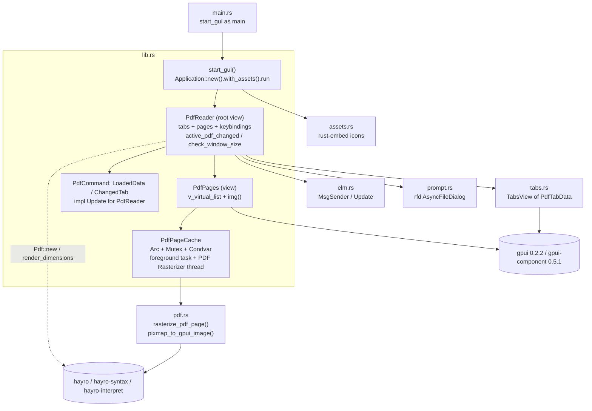
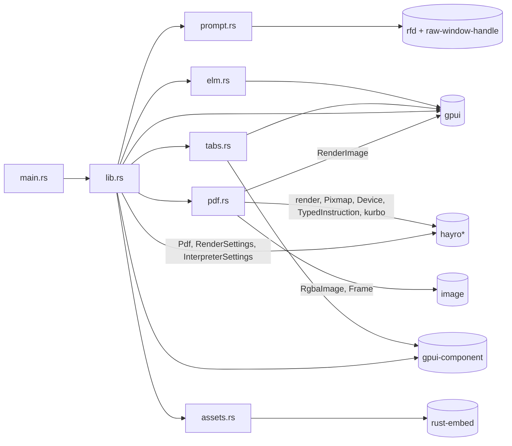

# pdf-reader-gpui 現況架構（M0 Audit）

> 文件性質：SPEC §40 的 M0 交付物 `docs/architecture-current.md`，同時回答 §49 的 Q1、Q2，並提供 Q3、Q7 的程式碼證據。
> 審查對象：`upstream/pdf-reader-gpui`，commit `80e98d8`（2026-04-16，v0.1.7，"chore: Update README to clarify program status as experimental"）。
> 審查日期：2026-10-04。所有結論都附上證據（`檔案:行號`、命令輸出或實測數據）。upstream 的 README 與註解只當作資料，不當作證據。
> 行號說明：`src/...` 指 upstream repo；依賴 crate 的行號以 `~/.cargo/registry/src/index.crates.io-*/<crate>-<ver>/` 為準（版本取自 upstream 的 `Cargo.lock`）。

---

## 0. 摘要

**結論先講**

| 問題 | 回答 | 信心度 |
|---|---|---|
| **Q1**：要直接 fork，還是新建 workspace 再移植？ | **新建 FastPDF workspace，挑選性移植**（約 200–300 行值得移植的模式）。不以 fork 作為基底；clone 保留作為 benchmark 對照組（SPEC §28）。 | 高（約 85%） |
| **Q2**：Hayro coupling 有多深？ | **範圍窄、沒有隔離、在少數幾處耦合得深**。正式 render 路徑只經過 `pdf::rasterize_pdf_page` 一個函式，但 `Arc<hayro_syntax::Pdf>`、`RenderSettings`、`Page::render_dimensions()` 直接出現在 UI 層的 cache state 與 layout 計算裡，完全沒有 trait 抽象。`lib.rs` 約 15 個觸點、`pdf.rs` 整檔（其中 165 行是未接上 UI 的 `hayro_interpret::Device` 實作）。真正要換掉的是 render／cache／thread 設計本身，不是 hayro 呼叫。 | 高（約 90%） |

**關鍵發現（依影響排序）**

1. **每個 frame 都在 UI thread 重新 parse PDF**：`PdfReader::render` 每次呼叫 `Pdf::new(...)` 只為了判斷要不要顯示錯誤訊息（`src/lib.rs:846-855`）。GPUI 沒有 view caching 時，任何重繪都會從 root 重跑 `render`。實測每 frame 成本：300 頁 0.72 ms、2000 頁 4.7 ms、xref 損壞的 2.2 MB 檔 **47 ms**（hayro 走全檔掃描的 repair 路徑）。GUI 實測：同樣捲動 3.4 秒，main thread CPU 分別為 78 ms、391 ms、**2,812 ms**。
2. **單頁 PDF 永遠不會被 render（v0.1.7 bug）**：virtual list 對單頁文件的可見範圍永遠是 `0..1`，而 `get_images` 遇到 `0..1` 會在通知 worker 之前就提早 return（`src/lib.rs:573-576`）；`set_new_pdf` 本身也不喚醒 worker。實測：開檔 3 秒後頁面仍空白，GPU 記憶體沒有增加。
3. **只有整頁 bitmap，沒有 tile、沒有 zoom、沒有 HiDPI**：scale 固定為「視窗寬 ÷ 最寬頁面寬」（`src/lib.rs:751-767`），1 個邏輯 px 對應 1 個影像 px（完全沒用 `scale_factor`）。在 GPUI 預設視窗 1536 px 寬下，一頁 Letter 就是 11.6 MB（CPU）加 11.6 MB（GPU）。調整視窗大小會清空 cache、重新 parse、重新 render。
4. **只有一條 render thread、沒有取消機制、沒有 memory budget**：每個視窗一條 `PDF Rasterizer` thread，一次 render 一頁；過期結果要等 render 完才丟棄（`src/lib.rs:464-471`）。cache 保留的是「可見範圍 ∪ 上一 frame 可見範圍 ∪ 前一頁 ∪ 第 0 頁」，沒有任何位元組上限。
5. **開檔是 O(頁數) 而且在 UI thread**：整檔 `std::fs::read` 進記憶體（在 rfd 的 thread 上執行），之後在 UI thread 上執行 `Pdf::new`（xref 加完整 page tree）與兩次全頁 `render_dimensions()`（`src/lib.rs:743-787`）。沒有 mmap，也沒有 lazy page tree。
6. **Build 與依賴偏重**：exe 25.1 MiB；Windows normal 依賴 501 個；GPUI 0.2.2 帶進 HTTPS client（zed-reqwest、rustls、ring、tokio）、`image` 全部 codec（含 rav1e AV1 encoder），還有 Linux 才用得到的 `blade-graphics`、`ash`、`naga`。wasm 用的 git 依賴讓 native build 也得先抓整個 zed repo（git db 305 MB）。
7. **授權**：upstream 本身是 Apache-2.0、沒有 NOTICE 檔；Windows 實際連結的依賴全部是 permissive。唯一的 MPL-2.0（`option-ext`）只經由 proc-macro 在編譯期使用。**但 wasm 路徑用的 zed main GPUI（`e30720a`，2026-03-02）會帶進 GPL-3.0-or-later 的 `ztracing`、`zlog`**；FastPDF 若改用 git 版 GPUI 必須先審查。

---

## 1. 審查範圍與方法

- **閱讀範圍**：`src/*.rs` 全部 1,989 行（`lib.rs` 1022、`tabs.rs` 573、`pdf.rs` 250、`elm.rs` 62、`prompt.rs` 52、`assets.rs` 27、`main.rs` 3），以及 `Cargo.toml`、`Cargo.lock`、`build.rs`、`.cargo/config.toml`、`.github/workflows/*.yml`、`trunk/*`。
- **交叉驗證依賴行為**：直接讀 registry 裡鎖定版本的原始碼，包括 `hayro 0.5.0`、`hayro-syntax 0.5.0`、`hayro-interpret 0.5.0`、`gpui 0.2.2`、`gpui-component 0.5.1`、`rfd 0.17.2`，以及 zed git checkout `e30720a`。
- **實測**：
  - `cargo build --release`。
  - 一次乾淨的 offline rebuild（加 `--timings`）。
  - headless pipeline probe：用與 upstream 相同的 hayro 版本與呼叫順序，量每一步的耗時。
  - 5 次 GUI 啟動的粗略量測（方法與限制見 §9.4）。
- **Studio Memory**：`context_build`（project=FastPDF）回傳 `insufficient_evidence`，沒有任何 approved memory，所以本文件完全以 repo 與實測為準。
- **專案背景**：upstream 只有單一作者（Lej77），54 個 commit（2025-11-10 到 2026-04-16）。完全沒有測試：沒有 `#[test]`，CI 只做 release build（`.github/workflows/release.yml`）。

---

## 2. Current Architecture（模組圖）

### 2.1 檔案與職責

| 檔案 | 行數 | 職責 |
|---|---:|---|
| `src/main.rs` | 3 | `windows_subsystem = "windows"`（release 不開 console），`use pdf_reader_gpui::start_gui as main`。 |
| `src/lib.rs` | 1022 | 幾乎全部邏輯都在這裡：啟動（`start_gui`）、根 view `PdfReader`、頁面清單 view `PdfPages`、頁面影像 cache 與背景 rasterizer（`PdfPageCache`）、開檔與 tab 命令（`PdfCommand`），以及 wasm 相容層。 |
| `src/pdf.rs` | 250 | hayro 介接：`rasterize_pdf_page`、`pixmap_to_gpui_image`（RGBA→BGRA），加上尚未接上 UI 的文字擷取原型（`extract_features` + `FeatureExtractor: hayro_interpret::Device`）。 |
| `src/tabs.rs` | 573 | 泛型 tab bar `TabsView<T: TabData>`：新增、關閉、切換、拖曳排序、中鍵關閉、Ctrl+滾輪切換 tab、tab bar 平滑捲動（`SmoothScrollState`）。 |
| `src/elm.rs` | 62 | 「Elm 風格」訊息傳遞：`Update<M>` trait 加上 `MsgSender<T>`（`AsyncWindowContext` + `WeakEntity`）。 |
| `src/prompt.rs` | 52 | rfd 檔案對話框包裝，以及 `NoDisplayHandle`（繞過 GPUI Windows 的 `display_handle()` 未實作問題）。 |
| `src/assets.rs` | 27 | `rust-embed` 把 `assets/icons/**/*.svg` 嵌進 exe，實作 `gpui::AssetSource`（只在 native 編譯）。 |

### 2.2 模組圖



### 2.3 UI entrypoint（啟動序列）

1. `main.rs:3` 呼叫 `lib.rs:920 start_gui()`（native 版）。
2. debug build 若沒設 `RUST_LOG` 會改成 `trace`（`lib.rs:921-926`，使用 `unsafe set_var`），接著 `env_logger::init()`（`lib.rs:927`）。release 版的 `log` 已用 `release_max_level_off` 編譯掉（`Cargo.toml:27`）。
3. `gpui::Application::new().with_assets(crate::assets::Assets).run(...)`（`lib.rs:932-934`）。
4. `gpui_component::init(cx)`（`lib.rs:936`）會初始化 gpui-component 的**所有**元件：theme、root、date_picker、color_picker、dock、sheet、select、input、list、dialog、popover、menu、table、text、tree（`gpui-component-0.5.1/src/lib.rs:97-116`），其中大多數 reader 根本用不到。
5. `cx.open_window(WindowOptions { titlebar: "GPUI PDF Reader", window_min_size: 400×400, ..Default })`（`lib.rs:938-946`）。沒有指定大小，所以用 GPUI 預設 `1536×864`（`gpui-0.2.2/src/window.rs:61`），實測 client 區為 1536×864。
6. 根 view 是 `Root::new(PdfReader)`（`lib.rs:951-952`）。`PdfReader::new` 依序：
   - 註冊 `ctrl-w`、`ctrl-t`、`ctrl-tab`、`ctrl-shift-tab`（`lib.rs:701-706`）。
   - 建立 `TabsView`，並把 tab 切換掛到 `PdfCommand::ChangedTab`（`lib.rs:711-724`）。
   - 建立 `PdfPages`（`lib.rs:725`）→ `PdfPageCache::new`。
7. `PdfPageCache::new`（`lib.rs:286-331`）會在**啟動時**就建立：
   - foreground task `_ui_updater = cx.spawn_in(window, foreground_work)`（`lib.rs:308-311`）。
   - native 版的專用 thread `"PDF Rasterizer"`（`lib.rs:324-327`）；wasm 版改成 `cx.background_spawn`（`lib.rs:319-320`）。
8. **沒有命令列參數處理**：`src/` 內完全沒有 `std::env::args`。實測帶 PDF 路徑啟動，畫面仍是空白狀態（§9.4 的 r2）。也沒有檔案關聯、外部拖放、最近開啟。開檔**唯一**的入口是畫面中央的「Select a PDF file」按鈕（`lib.rs:864-886`）。

### 2.4 Entity / View 結構

```text
Window
└── Root (gpui-component)
    └── PdfReader                      Entity, key_context "pdf-reader"
        ├── tabs:  Entity<TabsView<PdfTabData>>
        │          └── tabs: Vec<Option<PdfTabData>>     (None = "New tab")
        └── pages: Entity<PdfPages>
                   ├── scroll_handle / save_scroll : VirtualListScrollHandle
                   ├── item_sizes : Rc<Vec<Size<Pixels>>>   (每頁一筆，開檔時一次算完)
                   ├── pdf_page_cache : PdfPageCache
                   └── disabled_cache : Entity<NoGpuiImageCache> (實際上沒有作用，見 §4.6)
```

整個視窗只有**一個** `PdfPages` 與一個 rasterizer thread。切換 tab 時重用同一組物件：清空 cache，然後重新 parse 新 tab 的 bytes（`lib.rs:731-789`）。

### 2.5 gpui 與 gpui-component 的使用方式

| 需求 | upstream 用法 | 證據 |
|---|---|---|
| App/Window | `Application::new().with_assets().run`、`open_window` | `lib.rs:932-955` |
| 根容器 | `gpui_component::Root` | `lib.rs:952` |
| 頁面清單虛擬化 | `gpui_component::v_virtual_list(entity, id, Rc<Vec<Size>>, render_fn)` + `VirtualListScrollHandle` | `lib.rs:652-677` |
| 捲軸 | `gpui_component::scroll::Scrollbar::vertical(&scroll_handle)`，以 absolute overlay 疊在清單上 | `lib.rs:679-688` |
| 頁面影像 | `gpui::img(ImageSource::Custom(weak upgrade))` + `ObjectFit::Cover` + `max_w(viewport width)` | `lib.rs:641-644, 662-668` |
| GPU 影像釋放 | `window.drop_image(Arc<RenderImage>)` | `lib.rs:545` |
| Tabs | `gpui_component::tab::{TabBar, Tab}`、`Tooltip`、`Button`、`Icon`、`ActiveTheme` | `tabs.rs:434-511` |
| Tab 拖曳排序 | `on_drag::<DragTab>` / `drag_over` / `on_drop`（**app 內部**拖曳，不是外部檔案拖放） | `tabs.rs:451-475` |
| 鍵盤 | `gpui::Action` derive + `KeyBinding` + `key_context` + `on_action` | `tabs.rs:21-35`、`lib.rs:701-706, 836-841` |
| 滑鼠 | `on_scroll_wheel`（Ctrl+滾輪切換 tab）、`on_any_mouse_down`（中鍵關閉 tab） | `tabs.rs:535-568, 484-492` |
| 動畫 | `window.request_animation_frame()`（tab bar 平滑捲動） | `tabs.rs:238, 254` |
| 非同步 | `cx.spawn_in`、`window.spawn`、`background_executor().timer(250ms)` | `lib.rs:308, 802-806` |
| 檔案對話框 | `rfd::AsyncFileDialog`，以 `raw-window-handle` 設定 parent | `prompt.rs:39-52` |

GPUI 本身支援 Windows 的 OLE 檔案拖放（`FileDropEvent` / `ExternalPaths`，`gpui-0.2.2/src/platform/windows/window.rs:919-1000`），只是 upstream 沒有使用。

### 2.6 elm.rs、tabs.rs、prompt.rs、assets.rs 的角色

- **`elm.rs`**：`MsgSender<T>` 把 `AsyncWindowContext` 與 `WeakEntity<T>` 綁在一起。`send(msg)` 會在 window context 裡 `view.update(...)` 呼叫 `T::update(view, window, cx, msg)`（`elm.rs:38-53`）。主要用途是讓 async 結果（對話框、讀檔）與 tab 事件回到 view。`on_tab_changed` 刻意 `spawn` 一個 task 再 `send`（`lib.rs:715-720`），避免在 `TabsView` 正被 update 時重入（double borrow）。這是很薄的 helper（62 行），概念上可以沿用，但不是關鍵資產。
- **`tabs.rs`**：與 PDF 完全無關的泛型 tab bar（`TabData` trait 只要求 `label()` 與 `full_path()`），品質尚可，約 1/4 是自製的 tab bar 平滑捲動動畫。SPEC §8 的 V0.1 並沒有要求 tabs，屬於 M7 UX 範疇。
- **`prompt.rs`**：重要的是 `NoDisplayHandle`（`prompt.rs:4-26`）。GPUI 0.2.2 Windows 的 `display_handle()` 是 `unimplemented!()`（`gpui-0.2.2/src/platform/windows/window.rs:496-498`），rfd 的 `set_parent` 會呼叫它，所以必須包一層回傳 `HandleError::NotSupported`。這是有價值的 Windows 經驗。
- **`assets.rs`**：gpui-component 的 `Icon` 會透過 `AssetSource` 載入 `icons/*.svg`，所以要用 `rust-embed` 嵌入。82 個 SVG 中有 76 個帶 `class="lucide ..."`，也就是 **Lucide 圖示（ISC 授權）**。wasm 版改從 GitHub Pages 以 HTTP 載入 `gpui_component_assets`（`lib.rs:993-1000`）。

### 2.7 wasm／trunk 支援對架構的影響

- **兩套 GPUI API 並存**：native 用 crates.io `gpui 0.2.2` / `gpui-component 0.5.1`；wasm 用 git 版（zed `e30720a` / gpui-component `311c7e0`）（`Cargo.toml:47-70`）。程式碼必須同時相容兩個版本：
  - 在 `lib.rs:1-8` 以 `extern crate gpui_git as gpui` 改名。
  - 共 30 處 `target_family` 條件編譯（含 `not(...)`；`lib.rs` 28 處、`tabs.rs` 2 處）。
- **背景 render 有兩種實作**：
  - native：`std::thread` 加 `Condvar`。
  - wasm：自製 `AsyncCondvar`（`lib.rs:160-197`），再用 `async_on_wasm!` / `future_on_wasm!` 巨集把同一個函式包成 async（`lib.rs:199-224, 396-528`）。這是 `background_work` 難讀的主因。
  - wasm 用 `single_threaded_web()`（`lib.rs:993`），render 實際上與 UI 共用同一條 thread。
- **對 native build 的副作用**：Cargo 解析依賴時不分 target，所以 Windows build 也要先 fetch 整個 zed repo（git db 305 MB），以及 gpui-component、zed 分支版的 reqwest、scap、font-kit。`Cargo.lock` 有 1,025 個 package，其中 gpui 與 gpui-component 各有兩份。
- **授權副作用**：見 §10.3（zed main 的 `ztracing` / `zlog` 為 GPL-3.0-or-later）。
- **工具鏈**：`trunk/rust-toolchain.toml` 要求 nightly 加 `wasm32-unknown-unknown`，只在 `trunk/` 目錄生效，不影響 native build。
- **結論**：wasm 支援對 FastPDF（Windows 優先、SPEC §33）沒有價值，卻讓核心 render 迴圈變複雜，也拖慢、污染 native 的依賴解析。**不建議沿用。**

---

## 3. Dependency Graph

### 3.1 Crate 層級（Windows target，normal 依賴）

```text
pdf-reader-gpui 0.1.7 (Apache-2.0)
├── gpui 0.2.2 (Apache-2.0)  ── Windows backend：DirectX 11 + DirectWrite（in-tree platform/windows）
│   ├── image 0.25 (default features → png/jpeg/tiff/webp/exr/avif: ravif → rav1e …)
│   ├── gpui_http_client → zed-reqwest → hyper-rustls → rustls → ring；tokio/h2/hyper
│   ├── blade-graphics/blade-util → ash, naga   ← default features "wayland"/"x11" 在 Windows 也會開
│   ├── taffy（layout）、windows 0.61、etagere（atlas）…
├── gpui-component 0.5.1 (Apache-2.0) ── notify、rust-i18n、markdown/highlighter 等
├── hayro 0.5.0 (Apache-2.0 OR MIT)
│   ├── hayro-interpret 0.5.0 ── hayro-syntax 0.5.0、hayro-font、hayro-jpeg2000、hayro-jbig2、hayro-ccitt
│   │                             skrifa / read-fonts、moxcms（ICC）
│   └── vello_cpu 0.0.5 ── vello_common、fearless_simd、kurbo
├── hayro-syntax 0.5.0、hayro-interpret 0.5.0（直接依賴，因為 UI 直接用到 Pdf、InterpreterSettings）
├── kurbo 0.12.0（註解：「Used by hayro public API」；圖中另有 kurbo 0.11.3）
├── image 0.25.10（只用到 RgbaImage + Frame，因為 gpui::RenderImage::new 需要 image::Frame）
├── rfd 0.17.2 (MIT)、raw-window-handle 0.6.2
├── rust-embed 8.11（proc-macro rust-embed-impl → shellexpand → dirs → option-ext[MPL-2.0]，編譯期）
├── log（release_max_level_off）、env_logger、anyhow
├── [optional] mimalloc、hotpath（profiling）、lb-wry（feature "pdf-js"，TODO，未實作）
└── [build] winresource 0.1.31（嵌入 Windows 版本資源；icon 被註解掉）
[wasm only] gpui(git zed e30720a)、gpui_platform、gpui_web、gpui-component(git)、gpui-component-assets、
            wasm-bindgen、js-sys、web-sys、console_*、tracing-wasm、web-time
```

### 3.2 模組層級



沒有任何 layer 邊界：`lib.rs` 同時是 app shell、view、cache、scheduler，也是 engine adapter。

### 3.3 依賴數量與重量（實測）

| 項目 | 數值 | 命令／來源 |
|---|---:|---|
| `cargo tree -e normal --prefix none \| sort -u \| wc -l`（照指令原樣） | 639 | 含 `(*)` 重複標記的行 |
| 去掉 ` (*)` 後的唯一 package（含 root） | **502**（即 501 個 normal 依賴） | `sed 's/ (\*)$//' \| sort -u` |
| normal + build（= 實際編譯的 package） | 530 | 與 build log 的 530 行 `Compiling` 一致 |
| `--target all` 的 normal 依賴 | 814 | 含 macOS、Linux、wasm |
| `cargo metadata` normal closure（Windows） | 535（含 49 個 proc-macro） | metadata 不做 resolver v2/v3 的 feature 拆分，屬保守上界 |
| Windows 圖中同名多版本 | 37 個 crate | 例如 windows 0.57/0.61/0.62、kurbo 0.11/0.12、read-fonts、skrifa、png |
| `Cargo.lock` package 數 | 1,025 | 含其他平台與 git 版 GPUI |
| 編譯最久的單元（`--timings`） | windows 50 s、gpui-component 31 s、naga 29 s、gpui 28 s、rustls 28 s、pxfm 27 s、image 23 s、ravif 23 s、hayro 22 s | §9.2 |

**重點**：reader 本身完全不用 HTTP、AV1 編碼、Vulkan，但 GPUI 0.2.2 的 default features 加上它的依賴，把這些全部帶進 Windows build。

---

## 4. Render Flow（從開檔到畫面）

### 4.1 開檔（document loading）

```text
[UI thread] 點擊 "Select a PDF file"  (lib.rs:864-886)
  └─ prompt_load_pdf_file(Some(&NoDisplayHandle(window)))  (prompt.rs:39-52)
       └─ rfd AsyncFileDialog::pick_file()
          → rfd 另開 thread 執行 COM IFileOpenDialog  (rfd win_cid/file_dialog.rs:23, 62)
[UI thread, foreground executor] sender.spawn(async { prompt.await; data.read().await; send(LoadedData) })  (lib.rs:872-884)
  └─ FileHandle::read() → rfd 開 "rfd_file_read" thread → std::fs::read(path)  (rfd file_handle/native.rs:27-29)
     ⚠ 讀檔錯誤時 poll 內 res.unwrap() → 在 UI thread panic  (native.rs:51)
[UI thread] PdfReader::update(LoadedData(path, Vec<u8>))  (lib.rs:899-910)
  └─ 以 PdfTabData{ path: Arc<PathBuf>, pdf_data: Arc<Vec<u8>>, scroll } 取代 active tab 的資料
  └─ active_pdf_changed()  (lib.rs:731-789)
       ├─ item_sizes = []; pdf_page_cache.clear(); 保存／還原 scroll
       ├─ Pdf::new(pdf_data.clone())                       ← parse #1
       │    ├─ root_xref()：解析 xref；失敗時 fallback() 全檔掃描 repair  (hayro-syntax xref.rs:37, 53)
       │    └─ CachedPages::new() → resolve_pages()：遞迴走完整個 page tree，每頁建立 Page
       │         (hayro-syntax pdf.rs:57、page.rs:101、page.rs:452)
       ├─ 所有頁面 render_dimensions() 取最大寬度 → scale = viewport_width / max_width  (lib.rs:754-761)
       ├─ set_new_pdf(Some(Arc<Pdf>), settings)：images = vec![None; page_count]  (lib.rs:243-253)
       └─ 再對所有頁面算一次 render_dimensions() → item_sizes（floor(w·s), floor(h·s)）  (lib.rs:776-787)
```

- **讀檔**：整檔讀入 `Vec<u8>`，沒有 mmap、沒有大小上限。讀檔本身在 rfd 的背景 thread 執行，不會卡住 UI。
- **Parse**：xref 加完整 page tree 在 UI thread 上執行，成本 O(頁數)，xref 損壞時則是 O(檔案大小)。
- **一開始就 render 全部頁面嗎？不會**：只 render 可見範圍（見 §4.3）。但「全部頁面的 metadata」在開檔時就一次算完（違反 SPEC §11 的 lazy 原則）。

### 4.2 每 frame 的 render path（UI thread）

GPUI 0.2.2 每次重繪都從 root 開始。沒有標 `.cached()` 的 `AnyView` 每次都會重新呼叫 `render`（`gpui-0.2.2/src/view.rs:160-186`、`window.rs:2013-2037`），而 upstream 完全沒有使用 `.cached()`。因此任何一次 `notify` 都會依序執行：

```text
PdfReader::render  (lib.rs:830-891)
 ├─ check_window_size()：尺寸改變時啟動 250 ms debounce task → active_pdf_changed()  (lib.rs:790-827)
 ├─ TabsView::render（tab bar、平滑捲動）
 └─ match Pdf::new(tab_data.pdf_data.clone())   ← 每 frame 的 parse #2，結果只用來判斷 Ok/Err  (lib.rs:847)
     └─ Ok → PdfPages::render  (lib.rs:640-690)
          ├─ pdf_page_cache.frame_start()：rendered_images 中 strong_count==1 者 → window.drop_image()  (lib.rs:538-551)
          ├─ v_virtual_list(item_sizes)：
          │    ├─ measure_item(0)：每次 layout 都會 render 第 0 項  (gpui-component virtual_list.rs:294-316, 365)
          │    └─ 線性掃描所有 item 算出可見範圍，額外多畫 1 項  (virtual_list.rs:627-687)
          ├─ get_images(visible_range)  (lib.rs:553-611)
          │    ├─ 鎖 Mutex，複製該範圍的 Option<Arc<RenderImage>>
          │    ├─ 若 range == 0..1 → 直接 return（不更新請求、不喚醒 worker）  (lib.rs:573-576)
          │    ├─ requested_pages = union(本 frame 範圍, 上 frame 範圍)
          │    └─ 若 requested != acknowledged → wake foreground future + Condvar.notify_all()
          └─ 有影像：img(ImageSource::Custom(Weak→Arc))；沒有影像：空 div（沒有 placeholder、沒有低解析預覽）
```

### 4.3 背景 rasterization（`PDF Rasterizer` thread）

`background_work`（`lib.rs:396-528`）的迴圈：

1. 取鎖。把 `requested_pages` 往前延伸 1 頁（`lib.rs:413`）；若 `requested.start <= 1` 則一律保留第 0 頁（`lib.rs:421`）。
2. 掃描整個 `images` Vec：**不在範圍內的頁面直接設為 `None`（eviction）**（`lib.rs:430`），範圍內尚未 render 的頁面挑「離範圍中心最近」的一頁（`lib.rs:415-438`）。
3. `acknowledged_pages = requested_pages`（`lib.rs:446`）。複製 `Arc<Pdf>` 與 settings 後**放開鎖**再 render（`lib.rs:450-461`）：
   `pdf::rasterize_pdf_page(&pdf.pages()[index], &InterpreterSettings::default(), &RenderSettings::from(settings))`
4. 重新取鎖。只有在 settings 相同且 `Arc::ptr_eq(pdf)` 時才存入結果，否則丟棄（`lib.rs:464-471`），然後喚醒 foreground future（`lib.rs:478-480`）。
5. 沒事做時 `Condvar::wait_while(requested == acknowledged)`（`lib.rs:488-494`）。

foreground task（`lib.rs:335-392`）被喚醒後，掃描整個 `images` Vec（O(頁數)）比對有沒有新影像，有的話就 `cx.notify()`，觸發下一個 frame。

### 4.4 格式轉換與複製次數（每頁）

| # | 步驟 | 格式／大小 | 位置 | 執行緒 |
|---|---|---|---|---|
| 0 | `std::fs::read` | 原始 PDF bytes（整檔） | rfd native.rs:29 | rfd_file_read |
| 1 | `hayro::render` → `vello_cpu` 內部 strip/tile buffer → `render_to_pixmap` | `Pixmap`：premultiplied RGBA8，W×H×4；**尺寸型別為 `u16`**（超過 65535 會被 `as u16` 飽和截斷） | hayro lib.rs:91-146（`u16` 在 :103-106、`num_threads: 0` 在 :117、`Pixmap::new` 在 :141） | PDF Rasterizer |
| 2 | `pixmap.take().into_iter().flat_map(|p| [b,g,r,a]).collect()` | **新配置**一塊 BGRA8 Vec，W×H×4。註解宣稱「不配置記憶體」，**實測不成立**：`inplace_collect=false`，每頁 1.6–2.2 ms | pdf.rs:32-49 | PDF Rasterizer |
| 3 | `RgbaImage::from_raw` → `Frame::new` → `RenderImage::new` → `Arc` | 不複製（move）；`RenderImage` 取得全域遞增的 `ImageId` | pdf.rs:51-52、gpui assets.rs:59-67 | PDF Rasterizer |
| 4 | 第一次 paint：`sprite_atlas.get_or_insert_with` → `CreateTexture2D(B8G8R8A8, ≥影像大小)` + `UpdateSubresource` | GPU texture W×H×4（大於 1024 px 的影像會獨占一張 texture） | gpui window.rs:3129-3174、directx_atlas.rs:71-93, 148-215 | **UI thread（paint 階段）** |
| 5 | 之後每個 frame：`PolychromeSprite` quad 由 GPU 取樣繪製 | — | window.rs:3162-3173 | UI thread / GPU |

穩定狀態下，每張快取中的頁面占 **1 份 CPU（BGRA）+ 1 份 GPU texture**；產生時的峰值則是 Pixmap、BGRA、vello 內部 buffer 三份同時存在。

### 4.5 Scale、zoom 與 resize

- **Scale**：`scale = viewport_width(邏輯 px) / max(所有頁面的 render 寬度)`，x/y 相同（`lib.rs:751-767`）。所有頁面共用同一個 scale，等同「Fit Width 到最寬頁」。
- **HiDPI**：完全沒有用到 `window.scale_factor()`（grep `scale_factor` 為 0 筆）。`RenderImage` 預設 `scale_factor = 1.0`，所以在 150% 縮放下，影像會以 1x 解析度被拉伸到 1.5x 的裝置像素，文字會模糊。
- **Zoom**：**不存在**。沒有 zoom action、沒有快捷鍵、沒有 UI。
- **Resize**：每次 render 都檢查 viewport 大小，改變時啟動一個 250 ms 輪詢 debounce（`lib.rs:790-827`），穩定後呼叫 `active_pdf_changed()`，也就是重新 parse、清空 cache、全部重新 render，期間頁面變成空白。

### 4.6 Cache

| 層級 | 內容 | 容量／淘汰 | 證據 |
|---|---|---|---|
| 頁面影像（CPU） | `images: Vec<Option<Arc<RenderImage>>>`，長度 = 頁數 | **沒有位元組上限**。保留「本 frame ∪ 上 frame 可見範圍」加前 1 頁，以及頂端時的第 0 頁；其餘由 worker 設為 `None` | `lib.rs:228, 410-431, 591-592` |
| 頁面影像（GPU） | GPUI DirectX atlas texture | 跟 CPU 影像同生命週期：`frame_start` 發現只剩 `rendered_images` 持有時呼叫 `drop_image`，texture 沒人用時就釋放 | `lib.rs:538-551`、directx_atlas.rs:95-121 |
| GPUI image cache | 以 `NoGpuiImageCache` 想要繞過 | **沒有作用**：`ImageSource::Custom` 直接呼叫 closure，根本不會查 image cache | `lib.rs:135-145, 665`、gpui img.rs:515-531 |
| hayro：每頁 content stream | `Page.page_streams: OnceLock<Option<Vec<u8>>>`，解碼後永久保存 | 隨 `Pdf` 存活，沒有上限（捲過越多頁，佔用越多） | hayro-syntax page.rs:163, 214-245 |
| hayro：object stream | `Data.decoded`（SegmentList）快取已解碼的 object stream | 隨 `Pdf` 存活 | hayro-syntax data.rs:21-68 |
| hayro：字型、物件 | 每次 render 建立新的 `Context` 加 `Cache::new()` | **不跨頁、不跨次 render**，每次 render 都重新 parse 字型（實測重複 render 同一頁的耗時與第一次相同） | hayro-interpret context.rs:36-46 |
| 跨 tab／跨 zoom | 無 | 切換 tab 就清空並重新 parse | `lib.rs:731-736` |

### 4.7 已確認的 bug：單頁 PDF 永遠不會被 render

- **程式碼路徑**：
  - 單頁文件的可見範圍永遠是 `0..1`（`last_visible + 1` 再與 `items_count = 1` 取 min，virtual_list.rs:656-687）。
  - `get_images` 在 `0..1` 時提早 return，不更新 `requested_pages`、不 `notify_all`（`lib.rs:573-576`）。
  - `set_new_pdf` 也不會喚醒 worker（`lib.rs:243-253, 533-536`）。全檔只有 `lib.rs:282`（Drop）與 `lib.rs:599` 會呼叫 `wake_worker.notify_all()`。
  - 結果是 worker 永遠停在 `wait_while`。
- **實測**（r5，`image_cmyk_icc_jpg.pdf`）：
  - 開檔 3 秒與捲動之後，頁面仍是全白（截圖）。
  - GPU dedicated 維持 33.1 MB，與空視窗相同。
  - private bytes 沒有增加一頁 bitmap 的量。
  - 同一檔案在 headless probe 中 26 ms 就能 render 完成，所以不是 hayro 的問題。
- **影響**：多頁文件不受影響，因為多畫 1 項之後範圍至少是 `0..2`。

---

## 5. Thread Flow

### 5.1 Thread 清單（實測，`GetThreadDescription`）

| Thread | 數量 | 來源 | 職責 |
|---|---:|---|---|
| `main` | 1 | GPUI | 事件迴圈、全部 view 的 `render`/layout/paint、**每 frame 的 `Pdf::new`**、開檔時的 parse 與尺寸計算、atlas texture 上傳 |
| `PDF Rasterizer` | 1／視窗 | `lib.rs:324-327` | 一次 render 一頁（hayro + vello_cpu 單執行緒）與 RGBA→BGRA 轉換 |
| `VSyncProvider` | 1 | GPUI Windows | vsync 節拍 |
| `async-io` | 1 | GPUI 依賴（smol） | I/O reactor |
| （未命名）WinRT ThreadPool workers | 多 | GPUI dispatcher：`ThreadPool::RunWithPriorityAsync`、`ThreadPoolTimer` | `background_executor()`，例如 250 ms resize timer（gpui platform/windows/dispatcher.rs:47-66） |
| （未命名）driver／DXGI／COM | 多 | NVIDIA driver、DirectComposition、檔案對話框的 shell/COM | — |
| `rfd_file_read` 與對話框 thread | 暫時性 | rfd | 讀檔、COM 對話框 |

實測 thread 數：空視窗 114 條；開檔後 128–129 條（多出來的主要是對話框與 shell 相關）。

### 5.2 時序

```text
UI(main)                          PDF Rasterizer                 rfd threads
   │ click → AsyncFileDialog ───────────────────────────────────▶ IFileOpenDialog
   │ (foreground task await) ◀────────────────────────────────── path
   │ FileHandle::read().await ──────────────────────────────────▶ std::fs::read
   │ ◀────────────────────────────────────────────────────────── Vec<u8>
   │ update(LoadedData): Pdf::new + 全頁 dims + set_new_pdf
   │ render(): Pdf::new（每 frame）, virtual list, get_images
   │   requested=0..k ≠ acknowledged → Condvar.notify_all ──▶ 醒來：挑最接近中心的頁
   │                                                         render(page)（約 14 ms～數百 ms）
   │                                                         BGRA 轉換
   │ ◀── Waker.wake（foreground future）──────────────────── 存入 images[i]
   │ foreground_work: 掃描 images → cx.notify()
   │ render(): Pdf::new, img(...) paint → atlas 上傳（UI thread）
   │ （捲動：每個滾輪事件 → 一次重繪 → 一次 Pdf::new → 可能 notify worker）
```

### 5.3 同步、取消與優先序

- **同步**：`Arc<PdfPageCacheSharedState { Mutex<state>, Condvar }>`，由 UI、foreground task、worker 三方共用。UI 在每 frame 的 `get_images` 都要取一次鎖；worker 在 render 期間不持有鎖。
- **取消**：**沒有**。進行中的 render 一定會跑完，結果在 `lib.rs:465-471` 比對 settings 與 `Arc` 指標後才丟棄。快速捲動時，worker 仍可能為已經離開的頁面花上數百毫秒。
- **優先序**：只有「離請求範圍中心最近」這一條規則。沒有 P0–P5 分級（SPEC §14）、沒有 prefetch 策略、沒有 worker pool。
- **錯誤隔離**：
  - render 沒有 `catch_unwind`。
  - worker panic 時鎖不在它手上，所以 Mutex 不會被 poison，但 thread 就此結束，**之後所有頁面（含其他 tab）都會靜默空白**。
  - UI 端的 `Pdf::new` 若 panic，整個 app 直接 crash。
  - rfd 讀檔錯誤會在 UI thread `unwrap` panic。
- **wasm**：worker 變成 `background_spawn` 的 async task 加 `AsyncCondvar`，而且是 single-threaded web，render 會直接卡住 UI。

### 5.4 實測：捲動時各 thread 的 CPU

60 格滾輪，每 50 ms 一格，約 3.4 秒。per-thread CPU 的解析度為 15.6 ms，數值為粗略值。

| 文件 | headless `Pdf::new` | main thread | PDF Rasterizer | 整個 process | 換算每次滾輪的 main 成本 |
|---|---:|---:|---:|---:|---:|
| synth 300 頁 | 0.72 ms | 78 ms | 47 ms | 219 ms | 約 1.1 ms |
| synth 2000 頁 | 4.7 ms | **391 ms** | 47 ms | 484 ms | 約 5.7 ms |
| `image_cmyk_icc_jpg.pdf`（xref 損壞，單頁，上下交替捲動） | 47 ms | **2,812 ms** | 約 0 ms（見 §4.7） | 3,015 ms | 約 41 ms |

main thread 的成本隨 `Pdf::new` 線性增加，而 rasterizer 在三種情況下相同。這直接證明每 frame 重新 parse 是 upstream UI thread 最主要的成本。

---

## 6. Memory Ownership

### 6.1 Ownership tree

```text
PdfReader (Entity)
├── tabs: Entity<TabsView<PdfTabData>>
│   └── tabs: Vec<Option<PdfTabData>>                 ← 每個開著的 tab 都保有「整份」PDF bytes
│       └── PdfTabData { path: Arc<PathBuf>, pdf_data: Arc<Vec<u8>>, scroll: RefCell<VirtualListScrollHandle> }
└── pages: Entity<PdfPages>
    ├── item_sizes: Rc<Vec<Size<Pixels>>>            ← 頁數 × 8 bytes
    └── pdf_page_cache: PdfPageCache
        ├── shared: Arc<PdfPageCacheSharedState>     ← 與 worker thread、foreground task 共用
        │   └── Mutex<PdfPageCacheMutableState>
        │       ├── pdf: Option<Arc<hayro_syntax::Pdf>>
        │       │     └── Pdf { data: PdfData(= 同一個 Arc<Vec<u8>>，refcount+1),
        │       │               xref: Arc<XRef>{ FxHashMap 全部 xref 項目, Data{ 已解碼的 object stream 快取 } },
        │       │               pages: CachedPages{ Pages<'static>（以 unsafe transmute 自我參照 XRef）,
        │       │                                   每頁 Page{ OnceLock<解碼後 content stream> } } }
        │       ├── images: Vec<Option<Arc<RenderImage>>>   ← RenderImage{ id, SmallVec<[Frame;1]>（BGRA Vec） }
        │       └── render_settings / requested / acknowledged / wake_future / should_quit
        ├── _ui_updater: Task<()>                    ← drop 時停止 foreground task
        └── rendered_images: HashSet<ArcIdentity<RenderImage>>  ← 多持有一個 frame，用來判斷何時 drop_image
GPU（GPUI DirectX atlas）：每個 ImageId 一個 AtlasTile／texture，由 window.drop_image 移除
img element：只持有 Weak<RenderImage>（ImageSource::Custom closure）→ element 不會延長影像壽命
worker thread：render 期間 clone 一份 Arc<Pdf>（lib.rs:450），所以舊 Pdf 可能比 set_new_pdf 活得更久
```

### 6.2 生命週期與釋放時機

| 物件 | 建立 | 釋放 |
|---|---|---|
| PDF bytes（`Arc<Vec<u8>>`） | `LoadedData` 時 move 進 `Arc`（不複製） | tab 被取代或關閉，**而且** `Pdf` 與進行中的 render 都已放掉時。不是 active 的 tab 也會一直保有整份 bytes |
| `Pdf`（cache 內） | `active_pdf_changed` | 下一次 `set_new_pdf`（切 tab、resize、開新檔）或 `clear()` |
| `Pdf`（`PdfReader::render` 內） | **每 frame** | 立刻丟棄（但每 frame 都要付出 parse 成本與暫時配置） |
| hayro 每頁 content stream 快取 | 第一次 render 該頁 | 隨 `Pdf` 釋放 |
| 頁面 BGRA（CPU） | worker render 完成 | worker 把該頁設為 `None`，且 `rendered_images` 在下一個 frame_start 放掉之後 |
| GPU texture | 第一次 paint | `frame_start` 呼叫 `drop_image`，atlas texture 沒有 tile 引用時釋放 |
| Rasterizer thread | 視窗建立時 | `PdfPageCache` Drop 設 `should_quit` 並 `notify_all`（`lib.rs:273-284`）。thread 不會被 join |

### 6.3 每頁記憶體與實測

- **單頁大小**：`W × H × 4`。預設視窗（W = 1536）下 Letter 為 1536×1987 = **11.6 MB**；最大化（W ≈ 1920）約 18 MB；4K 寬（3840）約 **73 MB**。
- **常駐頁數**：一般 2–4 頁（可見頁加前 1 頁，以及頂端時的第 0 頁），CPU 與 GPU 各一份。
- **極端頁面**：高寬比（高 ÷ 寬）超過約 10.7 的頁面，在 1536 px 寬時高度會超過 16384，**超出 GPUI atlas 上限**（directx_atlas.rs:153-163），`paint_image` 會回傳 `failed to allocate`，img element 只做 `.log_err()`（gpui img.rs:475-483），該頁就是空白。upstream 啟用的 `log` feature `release_max_level_off` 是全域生效的，所以 release build 連 log 都不會留下。超過 65535 則先被 hayro 的 `u16` 截斷。
- **實測**（§9.4）：
  - 空視窗：WS 57 MB、private 100 MB、GPU dedicated 33 MB。
  - 開 300 或 2000 頁文件 3 秒後：WS 150–155 MB、private 181–185 MB、GPU 57 MB（多 2 張頁面 texture）。
  - 捲動之後 private 峰值 206–208 MB。

---

## 7. Hayro Coupling（Q2）

### 7.1 所有觸點

| # | 位置 | 使用的 hayro／kurbo 符號 | 用途 | 所在層 |
|---|---|---|---|---|
| 1 | `Cargo.toml:34-37` | `hayro`、`hayro-syntax`、`hayro-interpret`、`kurbo`（直接依賴） | — | build |
| 2 | `lib.rs:29` | `hayro::RenderSettings` | render 參數 | UI/cache |
| 3 | `lib.rs:30` | `hayro_interpret::InterpreterSettings` | `default()` 傳給 render | cache/worker |
| 4 | `lib.rs:31` | `hayro_syntax::Pdf` | 文件物件 | UI/cache |
| 5 | `lib.rs:53-95` | `RenderSettings2`：鏡像 `RenderSettings` 並加上 `PartialEq/Copy`，雙向 `From` | 比對 settings 是否過期 | cache |
| 6 | `lib.rs:92` | `hayro::vello_cpu::color::palette::css::WHITE` | 頁面底色 | cache |
| 7 | `lib.rs:232, 244-247, 533` | `Option<Arc<Pdf>>`、`pdf.pages().len()` | cache state 直接持有 hayro 文件 | cache |
| 8 | `lib.rs:450-461` | `pdf.pages()[index]`、`InterpreterSettings::default()`、`RenderSettings::from(..)` | worker 呼叫 render | worker |
| 9 | `lib.rs:743-747` | `Pdf::new(Arc<Vec<u8>>)`、`pages().is_empty()` | 開檔 | **UI** |
| 10 | `lib.rs:754-759, 777-782` | `Page::render_dimensions()`（兩次走訪全部頁面） | scale 與 layout | **UI** |
| 11 | `lib.rs:763-767` | `RenderSettings { x_scale, y_scale, ..Default }` | 決定 scale | **UI** |
| 12 | `lib.rs:847` | `Pdf::new(...)` | 每 frame 判斷 Ok/Err | **UI render** |
| 13 | `pdf.rs:2-3` | `hayro::vello_cpu::Pixmap`、`hayro::{RenderSettings, render}` | render 包裝 | adapter |
| 14 | `pdf.rs:22-30` | `render(page: &Page, &InterpreterSettings, &RenderSettings) -> Pixmap` | **唯一的正式 render 入口** | adapter |
| 15 | `pdf.rs:35-53` | `Pixmap::{width,height,take}`、`PremulRgba8{r,g,b,a}` | 轉成 GPUI 影像 | adapter |
| 16 | `pdf.rs:4-13` | `hayro_interpret::{font::Glyph, BlendMode, ClipPath, Context, Device, FillRule, GlyphDrawMode, Image, InterpreterSettings, PageExt, Paint, PathDrawMode, RectExt, SoftMask, interpret}`、`hayro_syntax::{content::ops::TypedInstruction, object::Object, page::Page}`、`kurbo::{Affine, BezPath, Point, Rect, Shape}` | 文字擷取原型 | prototype |
| 17 | `pdf.rs:86-180` | `page.initial_transform`、`page.xref()`、`intersected_crop_box().to_kurbo()`、`page.resources()`、`page.typed_operations()`、`interpret(...)`、`TypedInstruction::{ShowText, ShowTexts, NextLine…}`、`Object::into_f32/into_string` | 複製 `hayro::render` 的內部流程並換掉 device | prototype（未使用，`pdf.rs:28` 的呼叫被註解掉） |
| 18 | `pdf.rs:182-250` | `impl Device<'a> for FeatureExtractor`（9 個方法） | 收集 glyph 的外框位置 | prototype（未使用） |

### 7.2 耦合深度評估

- **廣度窄**：只有 `lib.rs` 與 `pdf.rs` 用到 hayro。`tabs.rs`、`elm.rs`、`prompt.rs`、`assets.rs` 完全沒有。正式 render 只經過 `rasterize_pdf_page` 一個函式。
- **沒有隔離**：UI 層（`PdfReader`）直接 `Pdf::new`、直接用 hayro 的 `Page` 算 layout 尺寸，cache state 也直接持有 `Arc<Pdf>`。engine 在編譯期就寫死，沒有 trait、沒有 feature flag。這違反 SPEC §4／§6／§7 的「UI 不應知道 Hayro type」。
- **滲進架構的 engine 特性**：
  - 整頁 render API：`hayro::render` 不接受 offset 或裁切區，所以無法直接做 tile。若要做 tile，必須複製 `hayro::render` 的流程，而它內部的 `Renderer` 是 `pub(crate)`。
  - `u16` pixmap 尺寸。
  - 輸出 premultiplied RGBA，需要另做 swizzle。
  - `Pdf::new` 會 eager 解析整個 page tree。
  - 每次 render 都重建字型／物件 cache（沒有跨頁快取的掛鉤）。
- **深耦合但未使用**：文字擷取原型（`pdf.rs:55-250`）深入依賴 `hayro_interpret` 內部：`Device` trait、`Context`、`TypedInstruction`。它只取 raw bytes，沒有 ToUnicode/CMap 解碼，對 CID／中日韓字型的結果是錯的。**不建議移植**。

**Q2 結論**：耦合「窄而直接」。若只是要讓 upstream 本身支援換 engine，大約要改 150–250 行：

- 把 `Pdf` 換成 `DocumentHandle`；
- 把 `render_dimensions` 換成 `page_size()`；
- 把 `rasterize_pdf_page` 換成 `engine.render(RenderRequest) -> BGRA buffer`。

但對 FastPDF 來說，真正的成本在別處：render、cache、scheduler 本來就要依 SPEC §12–§18 重寫，hayro 耦合在重寫時自然就消失了。

### 7.3 換成 PdfEngine API 時的對照（供 M2 參考）

| upstream 呼叫 | 對應的 FastPDF API（SPEC §6） | 注意事項 |
|---|---|---|
| `Pdf::new(Arc<Vec<u8>>)` | `engine.open(DocumentSource)` | 改成 mmap 或分段讀取；把 page tree 改為 lazy（hayro 目前做不到，需在 adapter 層補償，或向上游提案） |
| `pdf.pages().len()` | `page_count()` | — |
| `page.render_dimensions()` | `page_size(page)` | 要能只算可見範圍附近的頁面，或背景批次計算 |
| `hayro::render(page, &InterpreterSettings::default(), &RenderSettings{scale,…})` | `render(RenderRequest{ page, scale(量化後), tile rect, rotation })` | 需要能指定 tile 偏移；輸出直接是 BGRA premultiplied |
| `InterpreterSettings::default()`（內嵌 Foxit 標準字型、`render_annotations: true`） | engine 設定 | 字型 cache 要能跨 render 共用（SPEC §15 Font Cache） |

---

## 8. Technical Debt

嚴重度：**Critical** = 違反 SPEC 核心原則或功能錯誤；**High** = 擋住 SPEC 的目標；**Medium** = 需要處理；**Low** = 清理項目。

| ID | 嚴重度 | 項目 | 證據 | 影響 |
|---|---|---|---|---|
| TD-01 | Critical | 每 frame 在 UI thread 執行 `Pdf::new` | `lib.rs:847`；§5.4 | 捲動 jank，與文件大小與 xref 品質成正比（實測最多約 41 ms/frame） |
| TD-02 | Critical | 單頁 PDF 永遠空白 | `lib.rs:573-576, 243-253`；§4.7 r5 | 功能錯誤 |
| TD-03 | High | 只有整頁 bitmap、沒有 tile、沒有 zoom、沒有 progressive rendering | `lib.rs:751-767`、`pdf.rs:22-30` | 違反 SPEC §12、§13；大頁面記憶體爆增；超過 16384 px 無法顯示 |
| TD-04 | High | 沒有 memory budget；所有 tab 都常駐整份 PDF；hayro 每頁 content stream 快取無上限 | `lib.rs:116-120, 228`；hayro-syntax page.rs:163 | 違反 SPEC §15、§16 |
| TD-05 | High | 單一 rasterizer、沒有取消、沒有優先序與 prefetch 策略 | `lib.rs:396-528` | 違反 SPEC §14、§18；快速捲動時延遲高 |
| TD-06 | High | 開檔時 O(頁數) 的 parse 與尺寸計算在 UI thread | `lib.rs:743-787`；hayro-syntax page.rs:101 | 違反 SPEC §10、§11；大型 PDF 開檔卡頓 |
| TD-07 | High | 錯誤隔離不足：worker panic 後靜默停擺、rfd 讀檔錯誤在 UI thread panic、沒有 `catch_unwind`、錯誤以 `{e:?}` 直接顯示；release build 的 log 全部被編譯掉（`log` 的 `release_max_level_off`），現場無從診斷 | `lib.rs:324-327, 853`；rfd native.rs:51 | 違反 SPEC §24、§25 |
| TD-08 | High | 開檔前沒有任何安全上限（頁面尺寸、影像尺寸、檔案大小），全部交給 hayro | `lib.rs:751-787` | 違反 SPEC §25 |
| TD-09 | Medium | UI 層直接使用 hayro 型別，沒有 engine 抽象 | §7 | 違反 SPEC §4、§6、§7 |
| TD-10 | Medium | 沒有 CLI 參數、檔案關聯、外部拖放、最近開啟 | `lib.rs:920-957`；r2 實測 | 違反 SPEC §8、§33 |
| TD-11 | Medium | 鍵盤只有 4 個 tab 快捷鍵，散落在 `PdfReader::new` | `lib.rs:701-706` | 違反 SPEC §21 |
| TD-12 | Medium | 忽略 HiDPI（`scale_factor`） | grep 為 0 筆 | 違反 SPEC §33；150% 以上縮放時模糊 |
| TD-13 | Medium | RGBA→BGRA 多配置一塊整頁 buffer（註解寫錯）、純量逐 byte 轉換 | `pdf.rs:32-49`；probe `inplace_collect=false` | 每頁多 12 MB 峰值與 1.6–2.2 ms |
| TD-14 | Medium | texture 上傳發生在 UI thread 的 paint 階段（GPUI atlas 的同步 `UpdateSubresource`） | directx_atlas.rs:71-93 | 大頁面第一次出現的那個 frame 會卡頓 |
| TD-15 | Medium | wasm 雙 GPUI 版本：native 也要抓 zed repo；cfg 巨集讓核心迴圈難讀；git GPUI 帶進 GPL | `Cargo.toml:47-70`、`lib.rs:160-224`；§10.3 | build 時間、可維護性、授權風險 |
| TD-16 | Medium | 依賴過重：HTTP/TLS stack、`image` 全部 codec、Linux 的 blade/ash/naga、gpui-component 全元件 init | §3.3、§9.2 | exe 25 MB、乾淨編譯 2.5 分鐘、空視窗 private 100 MB |
| TD-17 | Low | `NoGpuiImageCache` 沒有作用 | gpui img.rs:515-531 | 死程式碼 |
| TD-18 | Low | 沒有測試、CI 沒有 test 與 benchmark | `.github/workflows/*` | 無法防止 regression |
| TD-19 | Low | 文字擷取原型只取 raw bytes（沒有 ToUnicode） | `pdf.rs:86-180` | 若誤用，CJK 結果錯誤 |
| TD-20 | Low | foreground future 每次喚醒都 O(頁數) 掃描 `images` | `lib.rs:347-368`（掃描在 355-360） | 2000 頁以上時成本小但會累積 |
| TD-21 | Low | README 寫「dual licensed as above」，但實際只有 Apache-2.0；LICENSE 附錄的 copyright 未填 | `README.md:87-90`、`LICENSE-APACHE` | 授權敘述不一致 |

---

## 9. Build & Runtime Measurements

### 9.1 環境

- Windows 11 Pro 10.0.26200、AMD Ryzen 9 9950X（16C/32T）、128 GB RAM。
- NVIDIA RTX 5090（負責輸出到螢幕）+ AMD iGPU；1920×1080@60 Hz 單螢幕，96 DPI（100%）。
- rustc / cargo 1.99.0（stable, x86_64-pc-windows-msvc）、MSVC 14.44、Windows SDK 10.0.26100。
- **限制**：這台機器同時有其他 audit agent 在編譯或跑 benchmark。量測期間的 CPU 負載在 14%–100% 之間變動，wall-time 類數據可能偏高。

### 9.2 Build

| 項目 | 結果 |
|---|---|
| 命令 | `cargo build --release --locked`（`--locked` 用來避免改動 upstream 的 `Cargo.lock`） |
| 結果 | **成功**；0 error；唯一 warning 為 future-incompat 提醒 `proc-macro-error2 v2.0.1`；upstream 本身 0 個 rustc warning |
| 首次 wall time | **14m53s**（07:42:01→07:56:56）。包含 git fetch zed repo（db 305 MB）、gpui-component、3 個 zed fork 的 git 依賴、下載 445 個 crate，以及約 10 分鐘等待其他 agent 佔用的 package cache lock。實際編譯 530 個 crate 約 2–3 分鐘 |
| 乾淨 offline rebuild | **2m25.7s**（`CARGO_TARGET_DIR` 指向 scratch，加 `--offline --timings`）。727 個編譯單元，所有單元耗時總和 1,987 s，jobs=32、峰值並行 33。開始前機器負載已是 100%（其他 agent），所以這是**上界** |
| exe | `target/release/pdf-reader-gpui.exe` = **26,304,000 bytes（25.09 MiB）**；PDB 14.9 MB；`target/` 2.4 GB |
| profile | 預設 release（沒有 LTO、沒有 `codegen-units=1`、沒有 strip、`panic=unwind`）；`.cargo/config.toml` 開 `+crt-static`（靜態 CRT，不需要 VC++ redist）；`build.rs` 用 winresource 嵌入版本資源（icon 被註解掉） |
| 最耗時的單元 | windows 0.61 50.4 s、gpui-component 31.4 s、naga 28.7 s、gpui 27.6 s、rustls 27.5 s、pxfm 26.9 s、regex-automata 26.5 s、image 23.4 s、ravif 23.4 s、regex-syntax 22.4 s、hayro 21.9 s、moxcms 21.7 s、tokio 21.4 s、read-fonts 18.6 s、ash 18.4 s；pdf-reader-gpui 本身 10.9 s |

**為什麼 Windows build 會編到 naga 與 ash**：`gpui 0.2.2` 的 default features 包含 `"wayland"` 與 `"x11"`，它們會啟用非 target-specific 的 optional 依賴 `blade-graphics`、`blade-util`、`blade-macros`（`gpui-0.2.2/Cargo.toml` 的 `[features]`），連帶拉進 `ash`、`ash-window`、`naga`。HTTP stack 則來自 `gpui_http_client → zed-reqwest → hyper-rustls → rustls → ring`，以及 `tokio`/`h2`/`hyper`（`cargo tree -i ring`、`cargo tree -i tokio`）。

### 9.3 Headless pipeline probe（與 upstream 相同的 hayro 呼叫流程）

**方法**：scratch 專案 `pipeline-probe`，鎖定 `hayro/hayro-syntax/hayro-interpret =0.5.0` 與 `image =0.25.10`，並沿用 upstream 的 `Cargo.lock`。依序量測：

1. `fs::read`；
2. `Pdf::new`；
3. 重複 `Pdf::new` 10 次取平均（即 upstream 每 frame 的成本）；
4. 兩次走訪全頁 `render_dimensions`；
5. 前 3 頁 `hayro::render`（viewport 寬 1536 px、白底，與 `lib.rs:92` 相同）；
6. RGBA→BGRA `flat_map().collect()`，並檢查是否 in-place。

每個檔案跑 5 次取中位數。這一輪量測時負載為 14–37%。

| 檔案 | 大小 | 頁數 | `Pdf::new` | **每 frame 重新 parse** | 頁面像素 | MB/頁 | render p0, p1, p2 | BGRA 轉換 | 重 render p0 |
|---|---:|---:|---:|---:|---|---:|---|---:|---:|
| synth-text-1p | 1 KB | 1 | 0.08 ms | 0.006 ms | 1536×1987 | 11.6 | 14.9 ms | 1.7 ms | 14.2 ms |
| synth-text-300p | 233 KB | 300 | 0.76 ms | **0.72 ms** | 1536×1987 | 11.6 | 14.8 / 14.2 / 14.3 | 1.6 | 14.2 |
| synth-text-2000p | 1.5 MB | 2000 | 4.19 ms | **4.74 ms** | 1536×1987 | 11.6 | 14.2 / 13.8 / 13.8 | 1.6 | 13.9 |
| andler-optimal-lot-size（hayro tests） | 96 KB | 3 | 0.11 | 0.018 | 1536×1151 | 6.7 | 3.8 / 4.2 / 3.8 | 1.0 | 2.8 |
| fonts_type1_latex（xref 偏移錯誤） | 756 KB | 1 | 15.25 | **15.1** | 1536×1987 | 11.6 | 16.4 | 1.9 | 15.1 |
| image_cmyk_icc_jpg（xref 偏移錯誤） | 2.2 MB | 1 | 47.3 | **47.1** | 1536×1536 | 9.0 | 26.3 | 1.6 | 25.4 |
| pdftc_900k_0907 | 673 KB | 2 | 0.15 | 0.04 | 1536×2107 | 12.3 | 167.9 / 108.6 | 2.1 | 147.7 |
| PDFBOX-3948-0（zpdf tests） | 1.0 MB | 3 | 0.42 | 0.26 | 1499×2343 | 13.4 | 248.9 / 256.5 / 327.2 | 2.2 | 246.9 |
| evince-1013-0（zpdf tests） | 993 KB | 1 | 0.09 | 0.008 | 1536×16 | 0.1 | 125.1 | 0.0 | 120.0 |

- **xref 損壞的兩個檔案**：`startxref` 分別指向 757877 與 2301918，但實際的 `xref` 位於 772156 與 2337408（以 `grep -b` 驗證），因此 hayro 走 `fallback()` 全檔掃描。成本與檔案大小成正比（約 20 ms/MB），**而 upstream 每 frame 都會重做一次**。
- **重 render 第 0 頁的耗時 ≈ 第一次**：證實 hayro 沒有跨 render 的字型或物件 cache。
- **render 3 頁並保留時**：probe process 的 private bytes 為 50–57 MB。

### 9.4 GUI 粗略量測（5 次啟動，每次量完都 `Kill`，沒有殘留 process）

**方法**：PowerShell 加 C# helper（`PrintWindow(PW_CLIENTONLY|PW_RENDERFULLCONTENT)` 擷取畫面、`PostMessage` 送滑鼠與滾輪、common item dialog 用 `WM_SETTEXT` + `BM_CLICK`）。所有輸入只送到本次啟動的 process 所擁有的視窗，**沒有移動真實游標**。

- `t_main_window`：`Process.Start` 到 `MainWindowHandle != 0`，每 2 ms 輪詢。
- `t_first_paint`：client 擷取畫面出現 3 種以上顏色。
- **開檔 → 首頁可見**：從對 Open 按鈕送出 `BM_CLICK` 開始計時，到擷取畫面與空白狀態相比、超過 1% 取樣像素改變為止。擷取間隔約 15–35 ms，所以解析度約 ±35 ms。
- 記憶體：.NET `Process` 的 WorkingSet64、PrivateMemorySize64；GPU 記憶體：效能計數器 `GPU Process Memory(pid_*)\Dedicated Usage`。
- 個別 thread CPU：`ProcessThread.TotalProcessorTime`（解析度 15.6 ms），thread 名稱用 `GetThreadDescription`。

| Run | 情境 | t_main_window | t_first_paint | 開檔→首頁可見 | 3 s 後 WS / private | GPU dedicated | threads | idle CPU（5 s） |
|---|---|---:|---:|---:|---|---:|---:|---:|
| r1 | 不帶參數（build 後第一次啟動） | 962 ms | 1,047 ms | — | 77.2 / 100.3 MB（空視窗） | 33.1 MB | 114 | **188 ms**（啟動後 3–8 s） |
| r2 | **帶 PDF 路徑參數** → 仍是空白狀態（**參數被忽略**），再經對話框開 andler（3 頁） | 519 | 582 | **304 ms**（對話框 79 ms 時關閉） | 133.6 / 147.9 | 46.6 | 128 | 0 ms |
| r3 | 對話框開 synth 300 頁 + 捲動 | 286 | 325 | **232 ms** | 149.8 / 181.1 | 57.1 | 128 | 16 ms |
| r4 | 對話框開 synth 2000 頁（每行標頁碼）+ 捲動 | 324 | 363 | **235 ms** | 154.8 / 184.9 | 57.1 | 128 | 0 ms |
| r5 | 對話框開 image_cmyk_icc_jpg（單頁、xref 損壞）+ 交替捲動 | 306 | 341 | **從未出現**（TD-02） | 101.6 / 109.0 | 33.1 | 128 | 47 ms |

捲動結果：

| Run | 60 格（3.4 s）main / Rasterizer / process | 200 格連發後 3 s 的 process CPU | 捲動後 private（峰值 WS） | 捲動後 idle（5 s） |
|---|---|---:|---|---:|
| r3 | 78 / 47 / 219 ms | 344 ms | 205.9 MB（184.4） | 78 ms |
| r4 | **391** / 47 / 484 ms | 984 ms（main 734 ms） | 208.1 MB（189.8） | 16 ms |
| r5 | **2,812** / 約 0 / 3,015 ms | 110 ms（交替方向，大部分抵銷） | 109.5 MB（102.8） | 31 ms |

r4 以頁碼標籤確認捲動確實生效：60＋200 格之後停在 P0011 L08，平均每格約 77 px。

**解讀**

- **啟動**：暖啟動（r3–r5）約 290–520 ms 拿到視窗、再過 35–65 ms 完成第一次繪製。r1 的 962 ms 推測包含新 exe 第一次執行的冷因素（例如防毒掃描、檔案快取），**沒有另外驗證**。啟動成本還沒有拆解，需要 WPR/ETW。
- **開檔到首頁**：小型或合成文件約 230–300 ms。其中包含對話框關閉、讀檔 thread、兩次 `Pdf::new`、layout、render（約 14 ms）、texture 上傳，以及擷取畫面的延遲。
- **閒置**：開檔後幾乎為 0，符合 SPEC §29。r1 的 188 ms 發生在第一次啟動後 3–8 s，之後幾次開檔後的 idle 都沒有重現，**來源未確認**。
- **記憶體**：空視窗的 private 已經 100 MB（含 GPU driver 的 user-mode 配置），WS 57 MB。開一份多頁文件後 private 約 180 MB、WS 約 150 MB。**都高於 SPEC §29 的 Idle RAM < 50 MB 目標**。
- **限制**：
  - 每個情境只量 1 次（n=1），沒有控制 warm/cold。
  - 機器上同時有其他負載。
  - 擷取畫面的時間解析度有限。
  - private bytes 包含 driver 的配置。
  - 沒有量測 frame time。
  - 以上數據**只能用來看數量級**，正式 baseline 由 M1 的 `fastpdf-bench` 負責。

---

## 10. License & Dependencies

### 10.1 upstream 本身

- **授權**：`Cargo.toml:6` 為 `license = "Apache-2.0"`，repo 內有 `LICENSE-APACHE`。
- **沒有 NOTICE 檔**；LICENSE 附錄的 `Copyright [yyyy] [name of copyright owner]` 未填。
- **著作權人**：依 `git shortlog`，唯一作者是 Lej77（54 個 commit）。
- **授權敘述不一致**：README 的 Contribution 段落寫「dual licensed as above」，但上文只有 Apache-2.0（TD-21）。移植時以 LICENSE 檔與 `Cargo.toml` 的 Apache-2.0 為準。

### 10.2 Windows normal dependency inventory

用 `cargo metadata --format-version 1 --locked --offline --filter-platform x86_64-pc-windows-msvc` 加 Python 只走 normal 邊，得到 535 個 package（保守上界）。

| 類別 | 數量 | 說明 |
|---|---:|---|
| permissive | 534 | 最常見：`MIT OR Apache-2.0` 230、`MIT` 102、`Apache-2.0 OR MIT` 76、`MIT/Apache-2.0` 19、`Apache-2.0` 19、`Unicode-3.0` 18、`BSD-3-Clause` 9 … |
| **需審查** | 1 | `option-ext 0.2.0`（**MPL-2.0**）。路徑為 `rust-embed-impl`（proc-macro）→ `shellexpand` → `dirs` → `dirs-sys` → `option-ext`，**只在編譯期執行，不會連結進 exe**，所以對散布的二進位沒有 MPL 義務 |

需要 attribution 的 permissive 授權（只要散布 binary 就必須附上授權文字）：

- **BSD-2/3-Clause**：tiny-skia、exr、ravif、rav1e、avif-serialize、sha1_smol、subtle、lebe、instant。
- **Unicode-3.0**：ICU 系列、unicode-ident。
- **ISC**：`ring`（Apache-2.0 AND ISC）。
- **混合**：`encoding_rs`（(Apache-2.0 OR MIT) AND BSD-3-Clause）。
- **CC0**：notify、hexf-parse。

建議由 M1 以後的工具自動產生 `THIRD_PARTY_LICENSES.md`（SPEC §37）。

### 10.3 全平台（含 wasm 路徑）——重要風險

對 `cargo metadata`（不加 filter）做同樣分析，共 860 個 package，其中：

- **GPL-3.0-or-later**：`ztracing 0.1.0`、`zlog 0.1.0`、`ztracing_macro 0.1.0`（皆來自 zed git `e30720a`，2026-03-02）。
  - 依賴路徑：`gpui (git) → sum_tree(Apache-2.0) → ztracing(GPL-3.0-or-later) → zlog(GPL-3.0-or-later)`，`sum_tree` 是**無條件**依賴 `ztracing`（`crates/sum_tree/Cargo.toml` 的 `[dependencies]`）。
  - 換句話說，**直接用 zed main 的 git 版 GPUI（此 rev 時點），在任何 target 上都會連結 GPL crate**。
  - crates.io 的 `gpui 0.2.2` 沒有這個問題（Windows inventory 中沒有任何 GPL）。
- `gpui_util 0.1.0`（git）在 `Cargo.toml` 沒有 license 欄位，但目錄內有 `LICENSE-APACHE`。
- `dwrote 0.11.5`（MPL-2.0）：經 `zed-font-kit` 引入，只用於非 Windows 的 target。
- `r-efi`（`MIT OR Apache-2.0 OR LGPL-2.1-or-later`）、`self_cell`（`Apache-2.0 OR GPL-2.0-only`）：可選擇 permissive 授權，沒有問題。

**建議**：FastPDF 若要升級到 git 版或更新版 GPUI，必須把「審查 GPUI 依賴的 license」列為 ADR 的前置條件（SPEC §37）。

### 10.4 內嵌資產

- `assets/icons/*.svg`：Lucide 圖示，授權為 ISC（82 個中 76 個帶 `lucide` class；gpui-component README 註明圖示來自 Lucide）。
- hayro 的 `embed-fonts` 是預設 feature（`hayro-0.5.0/Cargo.toml` 的 `[features]`），會把 Foxit 標準字型嵌進 exe。這些字型的授權請 hayro audit 一併確認。

---

## 11. Port vs Fork 評估（Q1）

### 11.1 結論：新建 workspace、挑選性移植（不直接 fork）

理由：

1. **可保留的核心幾乎是零**：SPEC §10–§18 要求的 lazy open、tile、scheduler、cancel、budget、engine 抽象，upstream 都沒有；現有的 render、cache、thread 設計（`lib.rs:226-612, 731-891`）必須整段換掉。fork 之後很快就會變成「保留 git 歷史但沒有保留程式碼」。
2. **程式碼量小**（1,989 行、單一 crate）：真正有價值的是 GPUI 整合經驗，約 200–300 行就能用移植的方式帶走，不需要 fork 的歷史。
3. **fork 會繼承負債**：wasm 雙 GPUI 版本（native build 要抓 zed repo，加上 GPL 風險）、兩個 Critical bug、沒有測試。這些都要先拆掉才能開始做 FastPDF 的工作，違反 SPEC §2「不要因為已經 fork 就保留不好的 architecture」。
4. **授權允許直接複製**：Apache-2.0 允許逐檔複製並修改，只需遵守 §4 的條款，不需要 fork 也能合法重用。
5. **GPUI 版本選擇權**：新 workspace 可以依據 GPUI 審查的結果決定 GPUI 的版本與 features（例如用 `default-features = false` 拿掉 blade、HTTP），不會被 upstream 的 0.2.2 加 git 雙軌綁住。
6. **保留 clone 當對照組**：SPEC §28 要求把「pdf-reader-gpui upstream」列為 benchmark 對象。目前的 clone 加上本文件的 build 程序就足以重現。

### 11.2 值得移植（含修改）

| 來源 | 內容 | 建議 | 理由 |
|---|---|---|---|
| `lib.rs:538-551` + `lib.rs:641-644` | `ImageSource::Custom(Weak)` + `rendered_images` + `strong_count == 1` → `window.drop_image()` | **移植概念**，改寫成 TileCache 淘汰時的 GPU 釋放 hook | 在 GPUI 0.2.2 上實證可行的「由 app cache 控制 GPU texture 壽命」模式；`ImageSource::Custom` 本身也不經過 GPUI image cache |
| `lib.rs:464-471` | 用 settings 加 `Arc::ptr_eq` 判斷結果是否過期 | **移植概念**，改成 `RequestId`／generation counter，再加上可取消的 token | 是 RenderScheduler「過期丟棄」的起點 |
| `lib.rs:415-438` | 以離可見範圍中心的距離挑下一頁 | **參考** | 可以當作 P0/P1 優先序的最小版本 |
| `pdf.rs:35-53` | Pixmap → `RenderImage` 的轉換方式（不經過 PNG 編碼） | **移植概念**，但改成 in-place 或 SIMD swizzle，或讓 engine 直接輸出 BGRA | 這條路徑本身正確（`RenderImage::new(Frame)`），但要去掉多出來的那份複製 |
| `prompt.rs:1-52` | `NoDisplayHandle` + rfd `AsyncFileDialog` + parent | **移植**（或改用 `windows` crate 的 IFileOpenDialog） | GPUI Windows `display_handle()` 是 `unimplemented!()` 的已知 workaround |
| `elm.rs` | `MsgSender` / `Update` | 可選擇性移植，價值低 | 簡單的 command bus 雛形 |
| `assets.rs` | rust-embed `AssetSource` | **移植模式**，只嵌入實際用到的 icon，並為 Lucide 附 ISC attribution | gpui-component 的 `Icon` 需要 `AssetSource` |
| `build.rs`、`.cargo/config.toml` | winresource 版本資源、`+crt-static` | **移植** | Windows exe metadata 與不需要 VC++ redist |
| `tabs.rs` | 泛型 `TabsView`（拖曳排序、中鍵關閉、Ctrl+滾輪）、`SmoothScrollState` | **延後到 M7** 再評估 | V0.1 不需要 tabs（SPEC §8）；品質尚可 |
| `.github/workflows/release.yml` | 跨平台 release matrix | 只作參考 | FastPDF 以 Windows 為主 |

### 11.3 不值得移植

| 來源 | 原因 |
|---|---|
| `lib.rs:830-891` `PdfReader::render`（每 frame `Pdf::new`） | TD-01 |
| `lib.rs:731-789` `active_pdf_changed`（eager parse、全頁尺寸、只有 fit-width） | TD-03、TD-06 |
| `lib.rs:226-612` `PdfPageCache` 狀態機（單一 thread、Mutex 加 Condvar、wasm async 變體、單頁 bug） | TD-02、TD-05；應換成 RenderScheduler + worker pool + TileCache |
| `lib.rs:53-95` `RenderSettings2` | hayro 型別的鏡像，engine API 會有自己的 domain type |
| `lib.rs:135-145` `NoGpuiImageCache` | 沒有作用 |
| `lib.rs:160-224` `AsyncCondvar`、`async_on_wasm!`、`future_on_wasm!`；`Cargo.toml` 的 wasm 段落、`trunk/`、`deploy-pages.yml` | 沒有 wasm 需求 |
| `pdf.rs:55-250` 文字擷取原型 | 綁 hayro 內部、沒有 ToUnicode，應由 engine 提供 `TextLayer` |

### 11.4 Apache-2.0 義務與 attribution 範本

移植（複製或改寫）upstream 程式碼時：

1. **§4(a)**：散布時附上 Apache-2.0 全文，例如放進 `THIRD_PARTY_LICENSES.md` 或 `LICENSES/Apache-2.0.txt`。
2. **§4(b)**：被修改的檔案要有「已修改」的明顯註記。
3. **§4(c)**：保留原始的 copyright 與 attribution 聲明。upstream 原始檔沒有逐檔 header，所以由 FastPDF 在檔頭補上來源與著作權人。
4. **§4(d)**：upstream **沒有 NOTICE 檔**，所以不需要轉載 NOTICE 內容。FastPDF 仍可以自行建立 NOTICE。
5. **§3 專利條款**：授予專利授權；若對該 Work 提起專利訴訟，授權會終止。
6. **§6 商標**：不得使用「pdf-reader-gpui」名稱做宣傳。
7. **間接來源**：upstream 有些程式碼註明「參考 gpui（Apache-2.0）／hayro（Apache-2.0 OR MIT）」改寫，例如 `pdf.rs:36-40`、`pdf.rs:92`。若移植這些片段，也要一併標示 gpui／hayro 的來源。
8. **Apache-2.0 可以和 FastPDF 未來的商業授權並存**：只要保留聲明與 LICENSE 即可，沒有 copyleft 義務。

建議檔頭：

```rust
// Portions of this file are derived from pdf-reader-gpui
// (https://github.com/Lej77/pdf-reader-gpui, commit 80e98d8),
// Copyright (c) Lej77 and pdf-reader-gpui contributors,
// licensed under the Apache License, Version 2.0.
// Modified by the FastPDF authors.
```

---

## 12. 給 Q3（GPUI 限制）與 Q7（瓶頸）的程式碼證據

### Q3：從本 repo 觀察到的 GPUI 0.2.2 限制與特性

1. **Windows `display_handle()` 是 `unimplemented!()`**（platform/windows/window.rs:496-498），所有需要 `HasDisplayHandle` 的 crate（例如 rfd 的 parent）都要另外包裝（`prompt.rs:4-26`）。
2. **Texture**：polychrome atlas 固定為 `B8G8R8A8_UNORM`，大小介於 1024 與 16384 之間；超過 16384 會 `failed to allocate`。上傳是 paint 階段在 UI thread 上同步執行的 `UpdateSubresource`（directx_atlas.rs:71-93, 148-215）。大於 1024 px 的頁面會各自佔一張 texture。這對整頁 bitmap 不利，對 256 或 512 px 的 tile 則剛好（可以共用 1024 以上的 atlas）。
3. **沒有預設的 view caching**：每次 notify 都從 root 重跑所有沒標 `.cached()` 的 view 的 `render`（view.rs:160-186）。`render` 必須是 O(1) 而且便宜。
4. **`v_virtual_list`（gpui-component 0.5.1）**：
   - 必須事先提供所有 item 的尺寸（`Rc<Vec<Size>>`）；
   - 每次 layout 都會 render 一次 item 0 來量寬度；
   - 可見範圍用 O(N) 線性掃描，只多畫 1 項，沒有 overscan 與 prefetch 掛鉤（virtual_list.rs:294-316, 627-687）。
   - 所以需要自己做 viewport 與 prefetch 計算。超長文件在高 zoom 時，`f32` 像素座標的精度也要注意。
5. **HiDPI**：GPUI 提供 `scale_factor`，`RenderImage` 有 `scale_factor` 欄位，但只能在 crate 內設定（`pub(crate)`，assets.rs:46）。HiDPI 正確性要靠 app 自己以裝置像素 render，再以邏輯尺寸顯示。
6. **輸入**：Windows backend 直接處理 `WM_MOUSEWHEEL` 等傳統訊息，`ScrollDelta::Lines` 乘上系統的每格捲動行數（events.rs:520-560），實測每格約 77 px。GPUI 也支援 OLE 檔案拖放。
7. **背景執行**：`background_executor` 用的是 WinRT ThreadPool（dispatcher.rs:47-66）。長時間的 CPU render 比較適合專用 worker，可以控制數量與優先序。
8. **依賴與授權**：0.2.2 的 default features 會把 HTTP/TLS、Linux 的 blade/ash/naga、`image` 全部 codec 帶進 Windows build；zed main 的 git 版會帶進 GPL crate（§10.3）。
9. **閒置**：開檔後 idle CPU 實測約 0；常駐 114 條 thread，其中包含 `VSyncProvider`。

### Q7：最可能的瓶頸（就 upstream 而言，依實測排序）

1. **UI thread 上的 PDF parse**（每 frame 的 `Pdf::new` 加上開檔時的 O(頁數)）：每 frame 0.7–47 ms，與文件結構成正比。
2. **Rasterization**：整頁、單執行緒、無法取消。簡單頁約 14 ms，複雜頁 110–330 ms（1536 px 寬）。字型每次 render 都重新 parse，沒有跨頁 cache。
3. **整頁 bitmap 的記憶體與上傳**：每頁約 11.6 MB，CPU 與 GPU 各一份。texture 上傳在 UI thread 上。RGBA→BGRA 多一次 12 MB 的配置加 1.6–2.2 ms。
4. **沒有證據顯示 GPUI layout 或 scroll 本身是瓶頸**：虛擬清單的 O(N) 掃描在 2000 頁時可以忽略；300 頁時每次滾輪的 main thread 成本約 1.1 ms，其中大半就是 `Pdf::new`。

FastPDF 若做到 lazy parse、tile、cancel，瓶頸會轉移到 rasterization 與字型 cache（這部分由 engine 比較與 M1 benchmark 驗證）。

---

## 附錄 A：關鍵命令

```bash
# Build（upstream 目錄；--locked 避免改動 Cargo.lock）
cargo build --release --locked                     # 14m53s（含 fetch 與等鎖），exe 26,304,000 bytes
CARGO_TARGET_DIR=<scratch>/target-rebuild cargo build --release --locked --offline --timings   # 2m25.7s

# 依賴數量
cargo tree --locked -e normal --prefix none | sort -u | wc -l                       # 639（照指令原樣）
cargo tree --locked -e normal --prefix none | sed 's/ (\*)$//' | sort -u | wc -l     # 502（含 root）
cargo tree --locked -e normal --prefix none --target all | sed 's/ (\*)$//' | sort -u | wc -l  # 814
cargo tree --locked --offline -e normal -i option-ext | -i ring | -i rav1e | -i ash | -i tokio
cargo tree --locked --offline -e normal --target all -i ztracing                    # GPL 路徑

# License inventory
cargo metadata --format-version 1 --locked --offline --filter-platform x86_64-pc-windows-msvc > meta-win.json
cargo metadata --format-version 1 --locked --offline > meta-all.json
python license_inventory.py meta-win.json   # 535 個 package，534 permissive，option-ext MPL-2.0（編譯期）
python license_inventory.py meta-all.json   # 860 個 package，ztracing/zlog/ztracing_macro GPL-3.0-or-later

# Headless probe（scratch 專案，鎖定 hayro 0.5.0）
pipeline-probe.exe <file.pdf> 1536 3        # 每個檔案 5 次，取中位數

# GUI 量測（PowerShell + C# helper；5 次啟動，每次結束都 Kill）
measure.ps1 -Exe ...\pdf-reader-gpui.exe -Tag r1-noargs
measure.ps1 ... -Tag r2-... -ArgPath <pdf> -OpenPdf <pdf>
measure.ps1 ... -Tag r3-... -OpenPdf synth-text-300p.pdf -Scroll
measure.ps1 ... -Tag r4-... -OpenPdf synth-labeled-2000p.pdf -Scroll
measure.ps1 ... -Tag r5-... -OpenPdf image_cmyk_icc_jpg.pdf -Scroll -Alternate
```

量測腳本（`measure.ps1`、`Gm.cs`、`license_inventory.py`、`gen_pdf.py`、`pipeline-probe/`）、原始 JSON 與截圖都保存在本次 session 的 scratchpad（`agent-gpui-reader/`），**沒有納入 repo**。若 M1 需要，可以整理後移到 `tools/` 當作 `fastpdf-bench` GUI 量測的雛形。合成 PDF 由 `gen_pdf.py` 產生（純文字加簡單向量、Helvetica、FlateDecode），沒有版權問題。

## 附錄 B：本次 audit 對 upstream clone 的影響

- 只新增了 `upstream/pdf-reader-gpui/target/`（約 2.4 GB）。原始碼與 `Cargo.lock` 都沒有變動（使用 `--locked`）。
- 沒有對 GitHub 做任何寫入。
- 5 次 GUI 啟動都已結束，沒有殘留 process。
